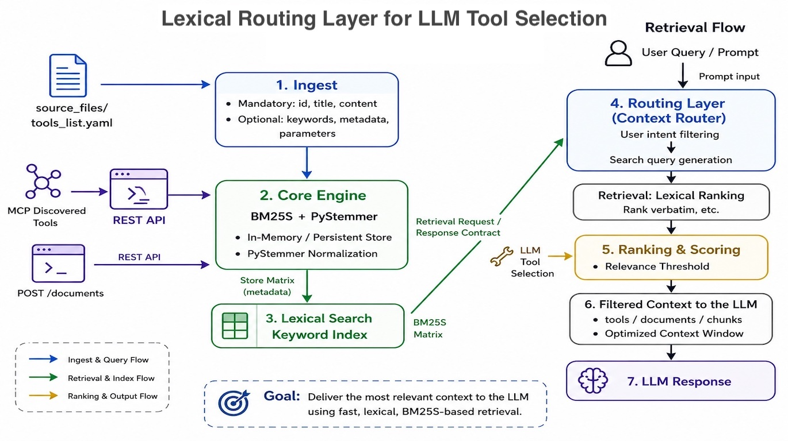

# Axiolex

[](https://pypi.org/project/axiolex/)
[](https://github.com/vrraj/axiolex/releases)


> **Interactive Demo UI:**  
> The GitHub repo includes a FastAPI-powered **Demo Web UI** for testing retrieval behavior, inspecting ranked results, adding documents, and tuning search parameters. See **[Demo Web UI](#demo-web-ui)** for setup instructions.

**AxioLex: autonomous agentic infrastructure for progressive tool discovery and real-time resource routing.**

**AxioLex** sits directly between the user prompt and LLM inference, **evaluating intent on the fly** and dynamically injecting only the **relevant tools**, documents, or workflows into the prompt. This keeps context windows clean, preserves critical runtime metadata, and **short-circuits** heavyweight UI artifacts so rendered assets stay out of the LLM text path.

Under the hood, the retrieval stack is powered by **BM25S + PyStemmer** for fast, deterministic lexical search, with optional **ColBERT late-interaction** for deeper semantic retrieval. This hybrid approach gives agentic systems precise routing across LLM tools, documents, hybrid RAG pipelines, and artifact-producing workflows.

## What AxioLex solves

**Problem:** AI agents and applications drown in irrelevant tools, documents, and context. Finding the right resource at the right time is manual, brittle, and wastes model context.

**Solution:** AxioLex is a compact retrieval and tool-routing layer that discovers, indexes, and returns only the resources that match the current intent.

### Three ways to use it

- **Install from PyPI** — embed `axiolex` as a Python package or use the `axiolex` / `axiolex-index` CLIs. Fast setup, no repo checkout, and you get the same runtime used by the platform.
- **Run the management platform** — start the FastAPI-backed web UI to onboard MCP providers, inspect cached tools, tune search, and refresh indexes interactively.
- **Automate via API/CLI** — register providers, store secrets, retrieve tools, and rebuild the catalog from CI, scripts, or another agent. Every UI action has a matching REST endpoint.

### Benefits

- Keeps LLM context windows clean by routing only relevant tools and documents
- Brings in external tools through MCP without hand-coding every integration
- Separates interactive management from runtime retrieval so either can run headless
- Works as a library, a local platform, or an API-backed service

### Implementation patterns

- **Embedded library** — add `axiolex` to an existing Python app and call the retrieval API. No FastAPI, no web UI, just `pip install axiolex`.
- **Management sidecar** — run `axiolex-server` (FastAPI) separately for the admin UI and provider onboarding. Your existing app still uses the `axiolex` library and the same Redis catalog.
- **Standalone platform** — run `make start` to get Redis (required), the FastAPI UI, and the MCP discovery server in one stack.

For details and commands, see [README_SETUP_USAGE.md](README_SETUP_USAGE.md).

## Features

**Tool discovery and routing**
- **MCP provider management** — Onboard and manage MCP tool providers through a web UI or YAML config. Supports both remote (Streamable-HTTP) and local (stdio subprocess) transports.
- **Streamable-HTTP transport** — Connect to remote MCP servers like Alpha Vantage, Tavily, and any MCP-compatible endpoint. API keys are appended as URL query parameters with configurable parameter names.
- **Stdio transport** — Spawn local MCP servers as subprocesses. Ships with a `stdio_servers/` directory for custom tool servers and supports pre-built packages from PyPI (`uvx`) and npm (`npx`) with automatic dependency isolation.
- **Encrypted secret store** — API keys and bearer tokens are encrypted with AES-256-GCM and stored in a git-ignored file. Secrets never appear in the browser, YAML config, Redis cache, or logs. Resolution falls back from environment variables to the encrypted store.
- **Per-provider tool retrieval** — Discover tools from individual providers on demand. Old tools are automatically invalidated before new ones are cached, so stale tools never linger.
- **Live tool counts** — The provider dashboard shows how many tools from each provider are currently cached in Redis.
- **Auto-reloading search index** — The BM25S index rebuilds automatically when the Redis catalog changes. No manual re-indexing after retrieving or deleting tools.

**Retrieval engine**
- **Lexical search (default)** — BM25S + PyStemmer for fast, deterministic keyword matching. Works out of the box with no model downloads.
- **Hybrid search (optional)** — Fuse BM25 lexical scores with ColBERT late-interaction semantic scores using per-model softmax normalization and weighted blending. Install with `uv add "axiolex[colbert]"`.
- **Tunable ranking** — Temperature, softmax cutoff, BM25/ColBERT weights, candidate limits, and minimum hybrid score thresholds.

**Web UI**
- **Demo dashboard** — Test retrieval queries, inspect ranked results with scores, and tune search parameters in real time.
- **MCP provider management** — Add, edit, enable, disable, and remove providers. Retrieve or delete cached tools per provider. API keys entered in masked fields with autocomplete disabled.
- **Document management** — Add and inspect YAML-loaded tool definitions and documents.

**Architecture**
- **Redis-backed shared catalog (required)** — Axiolex is a shared service: multiple applications discover tools from a common catalog. Redis stores discovery data (searchable) and runtime metadata (execution-ready) separately, enabling scalable tool catalogs without bloating process memory. Redis is a hard requirement — the server fails fast at startup if Redis is unreachable or the catalog is empty.
- **Catalog versioning** — When tools are added, removed, or modified (via UI, API, or MCP discovery), the Redis catalog version is automatically bumped. All consumers detect the version change and reload their in-memory search index on the next request — no manual re-indexing or restart needed.
- **Read-only MCP discovery server** — Axiolex exposes an MCP endpoint for other MCP clients to discover its tool catalog. Execution, auth, and guardrails stay in the host application.
- **REST API** — Full programmatic access to retrieval, provider management, secret management, and tool discovery endpoints.

**Current Implementation And Extension Path**

| Layer | What AxioLex has today | Where it can extend |
| --- | --- | --- |
| Retrieval | `BM25SRetriever`, REST `/retrieve`, lexical search, and optional ColBERT semantic hybrid search | More multi-modal retrieval modes |
| Tool discovery | MCP `discover_tools` returns execution-ready downstream tool definitions | A companion `call_tool` gateway can execute the selected tool |
| Tool metadata | YAML and runtime-injected documents carry `runtime`, `params`, and `artifact` fields | The same metadata can drive auth, policy, validation, and rendering decisions |
| Redis catalog | Separates searchable discovery data from runtime execution metadata | The same Redis deployment can hold gateway-owned policy, audit, latency, redacted response, and artifact-reference records |
| Artifact handling | AxioLex returns artifact intent so a host gateway can keep rendered payloads out of the LLM context | The gateway can inject UI artifacts directly and give the LLM compact semantic results |

The shipped MCP discovery server remains read-only. Execution, authentication,
guardrails, request logging, and observability belong in the host application
today, or in a future/application-owned `call_tool` gateway that sits beside
`discover_tools`.

For a concise map of what lives in Redis versus process memory, how BM25 and
ColBERT indexes are built, and how provider refresh paths work, see
[Component Ownership and Index Lifecycle](docs/architecture.md#component-ownership-and-index-lifecycle).

### Optional ColBERT Hybrid Search

The base install remains lexical-only and does not install ONNX Runtime or
download a model. Install and enable the optional BM25 + ColBERT path with:

```bash
# In an existing uv-managed Python project:
uv add "axiolex[colbert]"
export AXIOLEX_HYBRID_ENABLED=true
```

Hybrid requests set `hybrid_search=true`. They fuse positive BM25 results with
FastEmbed ColBERT late-interaction scores using per-model softmax
normalization and weighted score blending.

The problem this solves is score-scale mismatch. BM25 and ColBERT are useful
for different reasons, but their raw scores do not live on the same numeric
scale. BM25 is excellent at exact tool names, commands, and domain keywords;
ColBERT is better at broader semantic intent. If those result lists are fused
only by rank, the system can throw away the confidence signal that made BM25
work well in the first place. AxioLex instead turns each model's candidates
into a probability distribution independently, then blends those probabilities.

In human terms:

```text
1. Ask BM25 for lexical matches.
2. Ask ColBERT for semantic matches.
3. Convert each model's scores into its own confidence distribution.
4. Blend the two confidence values with configurable weights.
5. Sort and threshold on the final hybrid_score.
```

Calculation summary:

```text
P_bm25(doc) = softmax(BM25 scores / temperature)
P_colbert(doc) = softmax(ColBERT scores / temperature)

hybrid_score(doc) =
  normalized_bm25_weight * P_bm25(doc)
  + normalized_colbert_weight * P_colbert(doc)
```

Softmax is applied separately to each model's candidate list because BM25 and
ColBERT scores use different numeric scales. If a document appears in one
candidate list but not the other, the missing model contributes `0.0` for that
document. Weights are normalized internally, so `0.4 / 0.6`, `4 / 6`, and
`40 / 60` express the same blend.

This lets lexical precision and semantic recall cooperate without pretending
their raw scores are directly comparable.

Two small guardrails make this reliable in production:

1. **Do not softmax the whole database.** BM25 can return `0.0` when a
   document shares no query terms. If a large zero-score tail is included in
   the probability calculation, the distribution can become noisy and the
   threshold becomes harder to reason about. AxioLex avoids that by softmaxing
   only bounded candidate lists: positive BM25 candidates and the top ColBERT
   candidates, capped by `candidate_limit`.
2. **Start semantic-heavy, then tune.** A 50/50 split is not always ideal for
   tool routing. Exact words matter, but user intent often matters slightly
   more. Start with `bm25_weight=0.4` and `colbert_weight=0.6`, then adjust
   against real tool-routing queries.

When hybrid search is enabled, the ColBERT document embeddings are built
eagerly alongside the BM25 index during startup and whenever the catalog is
reloaded or reindexed. Queries only create a query embedding and score the
already-built document index.

Optional configuration:

```bash
export AXIOLEX_COLBERT_MODEL=colbert-ir/colbertv2.0
export AXIOLEX_COLBERT_CACHE_DIR=~/.cache/axiolex/fastembed
export AXIOLEX_COLBERT_BATCH_SIZE=32
export AXIOLEX_HYBRID_CANDIDATE_LIMIT=100
export AXIOLEX_HYBRID_BM25_WEIGHT=0.4
export AXIOLEX_HYBRID_COLBERT_WEIGHT=0.6
```

#### Pinned model verification

AXIOLEX pins its default `colbert-ir/colbertv2.0` model to a specific Hugging
Face commit and verifies the SHA-256 and size of the ONNX model plus its
required tokenizer/configuration files before FastEmbed loads them. Download or
verify the default model explicitly with:

```bash
axiolex model-ensure --cache-dir ~/.cache/axiolex/fastembed
# Or, from a source checkout (uses AXIOLEX_COLBERT_CACHE_DIR when set):
uv run --extra colbert -- axiolex model-ensure
```

The default integrity guarantee applies only to `colbert-ir/colbertv2.0`.
Setting `AXIOLEX_COLBERT_MODEL` to another model selects a user-managed model.

For local repository development, `make start` starts the complete Docker-backed
local stack (Redis + catalog refresh + both servers) in the background. See
[Key Makefile targets](#key-makefile-targets) and
[Where Redis can run](#where-redis-can-run) for Docker, non-Docker, and package
deployment options.

### User Search Behavior

Axiolex supports two request-time search modes. Lexical search remains the
default, including when the optional ColBERT capability is installed.

There are two common defaults to choose from:

- **Package, REST, and MCP default:** keep lexical search as the safe default.
  It works in the base install and does not require ColBERT dependencies,
  model downloads, or a warm semantic index.
- **Application or tuning default:** if your deployment installs
  `axiolex[colbert]`, sets `AXIOLEX_HYBRID_ENABLED=true`, and confirms hybrid
  search is available, make hybrid the default at your call site. This is the
  recommended production path when you want BM25 precision and ColBERT semantic
  recall together.

| Behavior | Lexical search | Hybrid search |
|---|---|---|
| Request option | `hybrid_search=false` or omitted | `hybrid_search=true` |
| Retrieval | BM25S + PyStemmer | BM25S + ColBERT late interaction + softmax score fusion |
| Ranking controls | Temperature, softmax cutoff, and ignore-zero | Temperature, BM25 weight, ColBERT weight, candidate limit, and optional `min_hybrid_score` |
| Result scores | `bm25_score`, `softmax_score` | BM25/ColBERT ranks, component scores, component softmax scores, and `hybrid_score` |
| Availability | Always available with the base package | Requires `axiolex[colbert]` and `AXIOLEX_HYBRID_ENABLED=true` |

Both REST search modes accept `max_results` to cap the final ranked results.
The MCP and Python `discover_tools` APIs expose the equivalent option as
`max_tools`. In the Demo Web UI, the **Max Tools** field applies to both
lexical and hybrid discovery.

Hybrid requests can optionally set `min_hybrid_score` to remove weak fused
results before applying `max_results` or `max_tools`. The default is disabled
so semantic-only discoveries are preserved while you tune. The older
`min_rrf_score` name is still accepted as a compatibility alias, but new
callers should use `min_hybrid_score`.

In lexical mode, BM25 scores are converted into softmax probabilities.
Temperature controls how concentrated those probabilities are, and the
softmax cutoff filters low-probability results.

In hybrid mode, temperature applies to both models independently before fusion.
Lower temperatures make each model's top candidates stand out more; higher
temperatures flatten the distributions. BM25 and ColBERT weights are
normalized internally, so `0.4 + 0.6`, `4 + 6`, and `40 + 60` represent the
same blend. A hybrid request fails clearly if the server has not enabled or
successfully initialized ColBERT; it does not silently fall back to lexical
search.

Hybrid score buckets in the Demo Web UI translate the final score into a
human-readable match status:

| Hybrid score | UI status | Meaning |
|---|---|---|
| `> 0.75` | Green circle, **Strong match** | The blended lexical/semantic confidence is high |
| `0.40` to `0.75` | Yellow circle, **Possible match** | Plausible result worth inspecting |
| `< 0.40` | Gray circle, **Weak match** | Low-confidence result, usually useful only while tuning |

Examples:

```python
# Python package
lexical = retriever.retrieve_documents("show open orders")
hybrid = retriever.retrieve_documents(
    "find purchases that have not completed",
    hybrid_search=True,
    temperature=0.7,
    bm25_weight=0.4,
    colbert_weight=0.6,
    candidate_limit=100,
    min_hybrid_score=0.4,
)
```

For tool routing, production callers can make hybrid the default by always
passing the hybrid tuning parameters to `discover_tools`:

```python
from axiolex import discover_tools

result = discover_tools(
    query,
    hybrid_search=True,
    temperature=0.7,
    bm25_weight=0.4,
    colbert_weight=0.6,
    candidate_limit=100,
    min_hybrid_score=0.4,
)
```

```bash
# REST API
curl -X POST http://localhost:9700/retrieve \
  -H "Content-Type: application/json" \
  -d '{"query": "find purchases that have not completed", "hybrid_search": true, "temperature": 0.7, "bm25_weight": 0.4, "colbert_weight": 0.6, "candidate_limit": 100, "min_hybrid_score": 0.4}'
```

The MCP `discover_tools` tool also accepts `hybrid_search` and
the same tuning controls: `temperature`, `bm25_weight`, `colbert_weight`,
`candidate_limit`, and `min_hybrid_score`. In the Demo Web UI, selecting
**Hybrid Search: BM25 + ColBERT** enables the hybrid-specific controls,
disables lexical-only cutoff and zero-relevance controls, and displays BM25
rank, ColBERT rank, component probabilities, numeric `hybrid_score`, and the
bucketed match status. If hybrid search is unavailable, the checkbox is
disabled and the UI explains the required server configuration.

Package and MCP `discover_tools` responses include the same score metadata as
the underlying retrieval result when available: `bm25_score`, `softmax_score`,
`bm25_rank`, `bm25_softmax_score`, `colbert_score`, `colbert_rank`,
`colbert_softmax_score`, and `hybrid_score`. Use `llm_tools_cutoff` for
lexical retrieval filtering and `min_hybrid_score` for hybrid retrieval
filtering.

Use it to search documents, route LLM tool calls, filter MCP-discovered tools, and build fast retrieval layers without running a vector database. When a selected tool produces an artifact such as an SVG chart, AxioLex returns the tool's runtime and artifact metadata; your host gateway can then execute the tool, render the artifact directly in the UI, and send only compact semantic context back to the model. Future extensions can add outbound execution, deeper observability, and more neural or multi-modal retrieval capabilities.

**[Quick Start ->](#install)**



<center><em>Figure: BM25S Retriever architecture for tool routing and context filtering</em></center>

## Why this exists

LLM applications often have too much context available: too many tools, too many documents, too many chunks, too many near-duplicate choices, and sometimes too much raw UI data.

This becomes more important in agentic systems where the LLM may have access to large tool registries. As the number of tools grows (20+), this becomes a scaling problem: context size increases, token costs rise, and tool selection becomes less reliable.

It becomes even more expensive when a tool returns display-oriented payloads such as SVG charts, maps, tables, or other artifacts. A model does not need thousands of SVG path coordinates to explain a six-month stock move. It needs the selected tool, the execution metadata, and a compact factual summary. The rendered asset belongs in the client UI pipeline, not in the model's token stream.

> `axiolex` gives you a small, deterministic lexical **retrieval layer** that can sit before an LLM and narrow the candidate set **before prompt assembly**.
> This package is designed for applications where many tools are available, but only a small subset is relevant for any given request. It also carries runtime and artifact metadata so downstream gateways can keep text reasoning and UI rendering on separate paths.

Typical flow:

```text
User Query / Prompt → BM25S Retrieval with stemming → Filtered Tools / Documents → LLM Context → Execution
```

Artifact-aware gateway flow enabled by today's metadata:

```text
User Query
  -> AxioLex retrieves the relevant artifact-producing tool
  -> Host gateway executes the selected runtime endpoint
  -> Gateway injects the rendered artifact into the client UI
  -> LLM receives compact metadata and writes text only
```

This becomes especially important in systems with large tool registries, where user intent maps to a **bounded set of actions**: trading, customer support, CRM, finance workflows, operations, and other tool-driven systems.

In these domains, the retrieval problem is often not broad semantic discovery. It is selecting the right tool, command, document, or workflow from a known set of possibilities.

>Clear action language matters: tool names, workflow names, order actions, support tasks, CRM operations, command phrases, and domain-specific vocabulary.

## What you get


- **Artifact-aware retrieval primitive** for agentic infrastructure with lexical search and optional ColBERT semantic hybrid search
- **Python retrieval library** for programmatic lexical search and tool routing
- **YAML-backed document/tool registry support** for static tool definitions and document collections
- **Runtime document/tool injection** for MCP-discovered tools and internal registries
- **REST service** for remote retrieval, dynamic indexing, and document/tool management
- **HTTP client** for connecting applications to the AxioLex REST service (supports remote deployments and service-oriented architectures)
- **Runtime metadata fields** (`runtime`, `params`) for tool execution routing
- **Artifact metadata fields** (`artifact`) for tools that produce renderable assets such as SVG
- **Clear extension path** to an outbound `call_tool` gateway for execution, auth, guardrails, and observability
- **BM25S + PyStemmer** for fast stemming-aware lexical matching
- **Softmax relevance scoring** with configurable temperature and cutoff filtering
- **Normalized response schema** with scores, rankings, metadata, and settings
- **Demo Web UI** for testing retrieval behavior, tuning parameters, and refining tool descriptions

## Usage Patterns

### YAML-Based Static Registries
Define tools and documents in YAML files for static, version-controlled registries. Ideal for:
- Pre-defined tool catalogs
- Document collections that don't change frequently
- Version-controlled knowledge bases
- Startup-time loading of known tool sets

```yaml
# tools.yaml
- id: get_customer_profile
  title: Get Customer Profile
  content: Lookup customer account details
  keywords: ["customer", "profile", "account"]
```

### Runtime Document/Tool Injection
Add tools and documents dynamically at runtime. Ideal for:
- MCP-discovered tools from external servers
- Combining static YAML with dynamic tool discovery
- Multi-source document aggregation
- Real-time tool registry updates

```python
# Inject MCP-discovered tools at runtime
mcp_tools = [
    Document(
        id="mcp_tool_1",
        title="MCP Tool",
        content="Description from MCP server",
        keywords=["mcp", "tool"],
        metadata={"source": "mcp"}
    )
]
retriever.add_documents(mcp_tools)
```

### Remote Service-Oriented Architecture
Run AxioLex as a standalone HTTP service. Ideal for:
- Multi-application environments sharing the same index
- Microservices architecture
- Remote deployments (AxioLex on separate server)
- Service-oriented integration patterns

```bash
# Start AxioLex REST service
uv tool install "axiolex[server]"
axiolex-server --config settings.yaml
```

```python
# Connect from any application
from axiolex import BM25SClient
client = BM25SClient("http://remote-server:9700")
results = client.retrieve("query")
```

### MCP Tool Injection
Combine MCP tool discovery with BM25S retrieval. Ideal for:
- Agentic systems with MCP servers
- Filtering MCP tools before LLM context assembly
- Hybrid static + dynamic tool registries

```python
# Load static tools from YAML
retriever = BM25SRetriever(document_file="tools.yaml")

# Inject MCP-discovered tools (your MCP client maps discovered tools to Document objects)
mcp_tools = discover_mcp_tools()  # Your MCP client maps discovered tools to Document objects
retriever.add_documents(mcp_tools)

# Search across both sources
results = retriever.retrieve_documents("user query")
```

### Artifact-Aware Tool Routing
Route tools that produce charts or other UI artifacts without asking the LLM to carry the rendered payload. Ideal for:
- Stock charts, visual analytics, maps, reports, and other display-heavy tool results
- Gateways that split front-end artifact payloads from LLM-facing summaries
- Future outbound tool gateways that centralize tool execution after retrieval
- Avoiding token bloat, malformed SVG/XML, and slow output streaming

What AxioLex provides today:

- Retrieval over enabled tool/document definitions
- `runtime` metadata for the selected downstream tool
- `params` metadata for tool arguments
- `artifact` metadata that tells the host application whether a selected tool is expected to produce a renderable artifact

AxioLex stores artifact intent in the tool definition and returns it with REST retrieval results when the source document includes it and is enabled for indexing. The repository's `get_stock_price_history` entry uses this artifact shape; enable the entry in your registry when you want it to participate in retrieval:

```yaml
artifact:
  produces_artifact: true
  injection_mode: verbatim
  artifact_type: svg
  artifact_key: svg
  placeholder: "{{ARTIFACT:stock_chart_svg}}"
```

A gateway can use the retrieved `runtime` block to execute the downstream tool, take the heavy `svg` field named by `artifact_key`, and inject that rendered asset directly into the client. The model-facing tool result can stay small:

```json
{
  "status": "success",
  "rendered_artifact_type": "svg",
  "artifact_id": "tsla-6m-chart",
  "summary_data_for_context": {
    "ticker": "TSLA",
    "period": "6M",
    "current_price": "184.10",
    "trend": "Rebound after earlier weakness"
  }
}
```

The outbound gateway can also attach its own strict UI payload to the user-facing message. This block is application-defined; AxioLex provides the retrieved tool, runtime, params, and artifact contract that lets the gateway build it deterministically:

```json
{
  "ui_injection": {
    "component": "ArtifactDisplay",
    "props": {
      "id": "tsla-6m-chart",
      "type": "image/svg+xml",
      "title": "TSLA 6-Month Performance"
    }
  }
}
```

That split is the core artifact short-circuit pattern enabled by the current metadata contract: the UI receives the rendered artifact from the host gateway, while the LLM receives only the facts needed to continue the conversation.

Extension path: the same pattern can grow from `discover_tools` into an outbound `call_tool` gateway. In that design, AxioLex still owns tool selection and runtime lookup, while the gateway owns execution:

```text
Agent asks for a capability
  -> discover_tools selects the execution-ready tool
  -> call_tool validates the request and resolves runtime metadata
  -> Gateway authenticates, enforces policy, executes the provider call
  -> Gateway logs request, response, latency, user/session, and artifact metadata
  -> Client receives UI artifacts; LLM receives compact semantic results
```

Because the Redis catalog already separates searchable discovery data from runtime execution data, the same deployment boundary can be extended with gateway-owned audit, policy, and observability records. That would make Redis the shared control plane for what tools exist, how they are reached, and how outbound calls are governed.

## Install

Install [uv](https://docs.astral.sh/uv/getting-started/installation/) first.
Then, in your uv-managed Python project:

```bash
uv add axiolex
```

`pip install axiolex` remains supported for consumers who do not use uv.

Links:

- **PyPI:** https://pypi.org/project/axiolex/
- **GitHub:** https://github.com/vrraj/axiolex
- **API Documentation:** https://vrraj.github.io/axiolex/

## Quick start

### Option A: Use directly in Python

*For Python applications (most common)*

Requires only the base package (no server extras):

```bash
uv add axiolex
```

```python
from axiolex import BM25SRetriever, Document

retriever = BM25SRetriever()

retriever.add_documents([
    Document(
        id="create_order",
        title="Create Order",
        content="Place a buy or sell order for a stock or equity trade.",
        keywords=["place order", "buy order", "sell order", "stock trade"],
        metadata={"category": "trading", "type": "tool"},
    ),
    Document(
        id="get_market_movers",
        title="Get Market Movers",
        content="Retrieve top gaining, losing, or most active market movers.",
        keywords=["market movers", "top gainers", "top losers", "most active"],
        metadata={"category": "trading", "type": "tool"},
    ),
])

results = retriever.retrieve_documents("place a limit buy order")

for doc in results["documents"]:
    print(doc["id"], doc["title"], doc["softmax_score"])
```

### Option B: Use as a REST service

*For shared services and web UI*

Install with server dependencies (includes FastAPI, Uvicorn, Jinja2):

```bash
uv tool install "axiolex[server]"
```

Start the server:

```bash
axiolex-server --config settings.yaml
```

Search documents:

```bash
curl -X POST http://localhost:9700/retrieve \
  -H "Content-Type: application/json" \
  -d '{"query": "show open customer orders"}'
```

Use the Python HTTP client:

```python
from axiolex import BM25SClient

client = BM25SClient("http://localhost:9700")
results = client.retrieve("show open customer orders")

print(f"Found {len(results['documents'])} matching tools/documents")
```

### Option C: Run the example script

*For quick testing (not production)*

```bash
curl -L -O https://raw.githubusercontent.com/vrraj/axiolex/main/examples/bm25s_basic_usage.py
python bm25s_basic_usage.py
```

## Primary use case: LLM, MCP, and artifact-aware tool routing

Modern agentic systems increasingly discover tools through **Model Context Protocol (MCP)**, internal registries, and service APIs. MCP standardizes tool discovery, but it does not decide which tools should be passed to the LLM for a specific user request.

That selection step still belongs in the MCP client, host application, or orchestrator.

AxioLex focuses on that selection step today. It ranks the relevant tools and documents, then returns the metadata a gateway needs to decide what happens next. For ordinary text tools, that may mean passing a small tool definition to the LLM. For artifact-producing tools, that means returning enough runtime and artifact metadata for the host gateway to execute the selected tool, inject the rendered artifact into the UI, and return a concise summary to the LLM.

The current public gateway primitive is `discover_tools`: find the right tool and return execution-ready metadata. The extension path is `call_tool`: accept the selected tool name and arguments, resolve the runtime record from the same catalog, enforce authentication and guardrails, execute the provider call, and record an audit trail for observability.

### Axiolex MCP discovery server

Axiolex can expose its query-time tool selection as a Streamable HTTP MCP
server. The server advertises one MCP tool, `discover_tools`. Calling that tool
returns the ranked downstream tools that the calling application can pass to
its LLM and local tool executor.

This keeps the shipped MCP server deliberately read-only and low-risk. Applications that want AxioLex to become the outbound execution gateway can extend the deployment with a separate `call_tool` layer beside discovery, using the same runtime records that `discover_tools` returns.

The MCP server is a read-only Redis cache consumer. It never discovers provider
tools, loads YAML into Redis, refreshes entries, or builds the cache. Build and
refresh the Redis tool cache through a separate administration process or CLI
before starting the MCP server. Startup fails clearly if Redis is unavailable
or the tool cache is empty. Every cached tool must include `tool_name`,
`transport`, and `endpoint`; an incomplete cache is rejected rather than
silently repaired by the MCP process.

#### Deployment ownership

Redis is part of the **Axiolex deployment**. It does not run inside, or need to
be accessible from, the external LLM agent or calling client.

```text
External LLM agent or client
        |
        | MCP requests to http://axiolex-host:9701/mcp
        v
Axiolex MCP server :9701
        |
        | read-only Redis access
        v
Redis tool catalog
        ^                         ^
        | writes and refreshes     | optional runtime lookup,
        |                          | audit logs, policy state
Axiolex index CLI                 Optional outbound call_tool gateway
        |
        | reads local config       | authenticated provider calls,
        | and discovers tools      | guardrails, observability
        v
tools_list.yaml +                 External HTTP/MCP/tool providers
mcp_providers.yaml +
provider credentials
```

| Component | Runs where | Responsibility |
| --- | --- | --- |
| External LLM/client | Client environment | Calls the Axiolex MCP endpoint only |
| Axiolex MCP server | Axiolex host/container | Serves `discover_tools` and reads Redis |
| Optional `call_tool` gateway | Axiolex host/container or application gateway | Executes selected tools, applies auth and policy, records observability events |
| Redis | Axiolex host/network | Stores the execution-ready tool catalog |
| Axiolex index CLI | Axiolex host/container | Builds and refreshes the Redis catalog |
| YAML files and credentials | Axiolex host/configuration system | Configure local tools and enabled MCP providers |

The external client does **not** need Redis access, YAML files, provider
credentials, or permission to run the indexer.

Provider secrets stay backend-only: configure an environment-variable name in
`auth.secret_env`; never put a credential in `mcp_providers.yaml`, a provider
URL, or static headers. AXIOLEX resolves that environment variable only while
making the provider request and redacts credential-bearing URLs in discovery
logs.

The shipped MCP discovery server reads Redis only. If you add an outbound
`call_tool` gateway, that gateway can use the same Redis database for
execution lookup plus gateway-owned keys for policy decisions, request logs,
latency metrics, redacted responses, artifact references, and audit trails.

#### Start the Axiolex deployment

The documented local setup uses these base ports:

| Component | Default address | Purpose |
| --- | --- | --- |
| Axiolex REST service | `localhost:9700` | Optional document retrieval REST API and UI |
| Axiolex MCP server | `localhost:9701` | MCP `discover_tools` endpoint |
| Axiolex Redis from the host | `localhost:6380` | Redis connection used by the indexer and MCP server |
| Redis inside its Docker container | `6379` | Redis's internal container port |

The index CLI is a one-shot process and does not listen on a port. In Docker's
`-p 6380:6379` syntax, `6380` is the configurable host port and `6379` is the
Redis port inside the container.

#### Where Redis can run

Redis is required for the shared MCP tool catalog, but it does not need to run
in Docker or inside the Axiolex Python package.

| Usage | Redis required? | Where Redis can run |
| --- | --- | --- |
| Direct `BM25SRetriever` Python usage with local documents | No | Retrieval indexes remain in the Python process |
| REST/UI server (web management platform) | Yes | Local Redis, Docker Redis, remote Redis, or managed Redis |
| Axiolex MCP `discover_tools` server | Yes | Reachable private Redis instance |
| Installed PyPI package used as an indexer or MCP server | Yes | Redis is deployed separately from the package |

All Axiolex processes that share a catalog must use the same Redis host, port,
and database:

```bash
export AXIOLEX_REDIS_HOST=localhost
export AXIOLEX_REDIS_PORT=6380
export AXIOLEX_REDIS_DB=0
export AXIOLEX_REDIS_DISCOVERY_TTL_SECONDS=0
export AXIOLEX_REDIS_RUNTIME_TTL_SECONDS=0
```

Set the TTL values to `0` when cached tool entries should remain until an
explicit catalog refresh, Redis eviction, or provider invalidation. Positive
values expire per-entry discovery/runtime writes after that many seconds.

##### Repository local testing with Docker

From a cloned repository, the simplest complete setup is:

```bash
make install   # base + server + dev tooling
make colbert   # optional: semantic/hybrid search
make start
```

`make start`:

1. Starts or reuses the dedicated `axiolex-redis` Docker container.
2. Refreshes the complete YAML and MCP-discovered tool catalog.
3. Starts the UI/API server on `http://localhost:9700` in the background.
4. Starts the MCP server on `http://localhost:9701/mcp` in the background.

Providers that cannot be discovered are logged and skipped (non-fatal). You can
retrieve a provider's tools manually from the UI at
`http://localhost:9700/#mcp_providers`.

The default Docker mapping is `localhost:6380` on the host to Redis port
`6379` inside the container.

To start only Redis manually:

```bash
docker run -d --name axiolex-redis -p 6380:6379 redis:7
```

This publishes the dedicated Axiolex Redis instance at `localhost:6380`, which
matches Axiolex's default Redis connection when Axiolex runs directly on the
same host. Using host port `6380` avoids conflicting with a client application's
existing Redis instance on the standard port `6379`.

If host port `6380` is already in use, choose another available host port, such
as `6381`, while keeping the container port as `6379`:

```bash
make start REDIS_PORT=6381 REDIS_CONTAINER=axiolex-redis-6381
```

##### Repository local testing without Docker

Run Redis directly on the host, for example with Homebrew:

```bash
brew install redis
brew services start redis
```

Because `make start` manages a Docker container, start Redis on the host
and point Axiolex at it instead:

```bash
make index-refresh REDIS_PORT=6379
# Then launch the servers manually (see `make start` output for the commands):
uv run --extra colbert -- axiolex --config settings.yaml --port 9700 &
uv run --extra colbert -- axiolex-mcp-server --transport streamable-http --host 0.0.0.0 --port 9701 &
```

##### Installed package or remote Redis

The installed Python package does not install or manage Redis. Deploy Redis
separately, then configure every Axiolex process to use it:

```bash
export AXIOLEX_REDIS_HOST=redis.internal.example
export AXIOLEX_REDIS_PORT=6379
export AXIOLEX_REDIS_DB=0
export AXIOLEX_TOOLS_FILE=/etc/axiolex/tools.yaml
export AXIOLEX_MCP_PROVIDERS_FILE=/etc/axiolex/providers.yaml

axiolex-index refresh
axiolex-server --config /etc/axiolex/settings.yaml
axiolex-mcp-server --host 0.0.0.0 --port 9701
```

Redis may be a local service, a private container, another host on the private
network, or a managed Redis service. Do not expose Redis publicly. External LLM
clients connect to the Axiolex MCP endpoint and do not need Redis access.

Verify that Redis is running and reachable:

```bash
# Redis should respond with PONG.
docker exec axiolex-redis redis-cli ping

# Axiolex should report the current Redis catalog status.
axiolex-index status
```

If Axiolex also runs inside Docker, do not configure it to use `localhost`.
Place both containers on the same Docker network and configure Axiolex to
connect to `axiolex-redis:6379`.

The basic development command does not preserve Redis data after the container
is removed. To persist the catalog in a Docker volume:

```bash
docker run -d \
  --name axiolex-redis \
  -p 6380:6379 \
  -v axiolex-redis-data:/data \
  redis:7 redis-server --appendonly yes
```

The index and MCP CLIs also accept `--redis-host`, `--redis-port`, and
`--redis-db`. The REST/UI server reads the shared `AXIOLEX_REDIS_*`
environment variables.

Build or refresh the complete Redis catalog before starting the MCP server:

```bash
axiolex-index --redis-port 6380 refresh \
  --tools-file /path/to/your/tools_list.yaml \
  --providers-file /path/to/your/mcp_providers.yaml
```

The indexer loads enabled YAML tools, discovers tools from every enabled MCP
provider, validates execution metadata, atomically replaces the Redis catalog,
prints a JSON summary, and exits. By default, an enabled MCP provider returning
no tools aborts the refresh and leaves the previous Redis catalog untouched.
Use `--allow-partial` only when intentionally accepting a partial catalog.
Each successful replacement writes a new catalog version. The read-only MCP
server detects that version on the next `discover_tools` call and reloads its
enabled in-memory retrieval indexes without requiring a restart. This rebuilds
BM25 and, when hybrid search is enabled, ColBERT.

Both YAML files are caller-owned local configuration. They are passed
explicitly and are not assumed to live inside the installed Python package.
The calling application can alternatively configure them through environment
variables:

```bash
export AXIOLEX_TOOLS_FILE=/path/to/your/tools_list.yaml
export AXIOLEX_MCP_PROVIDERS_FILE=/path/to/your/mcp_providers.yaml
axiolex-index refresh
```

Inspect the current catalog:

```bash
axiolex-index --redis-port 6380 status
```

The same indexing boundary is available directly to Python callers. In a
synchronous program, use `asyncio.run()` because `refresh()` performs
asynchronous MCP provider discovery:

```python
import asyncio

from axiolex import ToolIndexingService
from axiolex.core.cache import RedisConfig, ToolCacheManager

cache_manager = ToolCacheManager(
    RedisConfig(
        host="localhost",
        port=6380,
        db=0,
    )
)

result = asyncio.run(
    ToolIndexingService(
        tools_file="/path/to/your/tools_list.yaml",
        providers_file="/path/to/your/mcp_providers.yaml",
        cache_manager=cache_manager,
        allow_partial=False,
    ).refresh()
)
print(result.to_dict())
```

Inside an asynchronous application such as FastAPI, reuse the configured
`cache_manager` and call `refresh()` with `await` instead:

```python
from axiolex import ToolIndexingService

async def refresh_tool_catalog():
    indexer = ToolIndexingService(
        tools_file="/path/to/your/tools_list.yaml",
        providers_file="/path/to/your/mcp_providers.yaml",
        cache_manager=cache_manager,
    )
    result = await indexer.refresh()
    return result.to_dict()
```

The programmatic equivalents of the index CLI operations are:

| CLI operation | Python API |
| --- | --- |
| `axiolex-index refresh` | `await indexer.refresh()` |
| `axiolex-index status` | `indexer.status()` |
| `--allow-partial` | `allow_partial=True` |

The indexer is a one-shot administration CLI and does not require a port. Keep
the MCP discovery server on port `9701`. If remote refresh triggering is needed
later, expose the indexing service through a separately authenticated private
admin API rather than through the public MCP server.

#### Refreshing the catalog and retrieval indexes

Catalog refresh and retrieval reindexing are separate operations:

| Operation | Command or endpoint | Result |
| --- | --- | --- |
| Refresh shared Redis catalog | `axiolex-index refresh` or `make index-refresh` | Rebuilds Redis from YAML tools and enabled MCP providers |
| Reindex running REST/UI server | `POST /documents/reindex-bm25s` | Reloads available tools and rebuilds BM25 plus enabled ColBERT indexes |
| Reload running REST/UI documents | `POST /documents/reload` or `client.reload_documents()` | Discards runtime-added documents, reloads available tools, and rebuilds enabled retrieval indexes |
| Reload direct Python retriever | `retriever.rebuild_index()` | Reloads the retriever's local documents and rebuilds enabled retrieval indexes |

For example, reindex the running REST/UI server on its default port:

```bash
curl -X POST http://localhost:9700/documents/reindex-bm25s
```

The installed package does not currently provide a CLI command that directly
reindexes a running server's in-memory retrieval indexes. Use the REST endpoint
for that operation. After `axiolex-index refresh`, the MCP discovery server
automatically detects the new Redis catalog version and rebuilds its enabled
retrieval indexes on the next `discover_tools` request.

Start the MCP server:

```bash
axiolex-mcp-server \
  --host 0.0.0.0 \
  --port 9701 \
  --redis-port 6380
```

Connect MCP clients to:

```text
# Client running on the Axiolex host:
http://localhost:9701/mcp

# Client running elsewhere:
http://axiolex-host:9701/mcp
```

Runnable end-to-end examples are included:

```bash
# Build and verify the Redis catalog from caller-owned configuration.
python examples/test_index_refresh.py \
  --tools-file /path/to/your/tools_list.yaml \
  --providers-file /path/to/your/mcp_providers.yaml

# In another terminal, start the read-only MCP server.
axiolex-mcp-server --host 0.0.0.0 --port 9701 --redis-port 6380

# Connect as an external MCP client and call discover_tools.
python examples/mcp_axiolex_discovery.py \
  --query "get stock price history" \
  --max-tools 3
```

MCP testing examples:

- `examples/mcp_axiolex_discovery.py` tests Axiolex `tools/list` and
  `discover_tools`.
- `examples/mcp_alphavantage.py` connects directly to the Alpha Vantage MCP
  provider for provider-level debugging.

Run the direct provider test with:

```bash
ALPHAVANTAGE_API_KEY=your-key python examples/mcp_alphavantage.py
```

The bind address `0.0.0.0` makes the server reachable through the machine or
container hostname too, such as `http://axiolex:9701/mcp`. URL fragments such
as `#discover-tools` are browser-only and are not part of an MCP endpoint.

Example MCP client:

```python
import asyncio

from mcp import ClientSession
from mcp.client.streamable_http import streamable_http_client


async def main():
    async with streamable_http_client("http://localhost:9701/mcp") as streams:
        async with ClientSession(*streams[:2]) as session:
            await session.initialize()

            # tools/list exposes Axiolex's discover_tools function.
            print(await session.list_tools())

            # tools/call returns selected downstream tool definitions.
            result = await session.call_tool(
                "discover_tools",
                {"query": "get stock price history", "max_tools": 5},
            )
            print(result.structuredContent)


asyncio.run(main())
```

Each returned downstream tool includes:

- `name`: exact tool name for execution
- `description`: tool purpose
- `params` and `inputSchema`: parameter definitions
- `endpoint`: HTTP, MCP, or provider-specific endpoint configuration
- `transport`: execution transport
- `provider`: provider identifier, when available

The MCP `discover_tools` result is intentionally execution-focused. It returns the downstream tool definition that a calling application can execute through its own gateway. REST `/retrieve` results preserve the full retrieved document shape, including `runtime`, `params`, and `artifact` metadata for YAML-loaded tools.

For direct Python use without MCP:

```python
from axiolex import discover_tools

result = discover_tools("get stock price history", max_tools=5)
```

For an application that has enabled hybrid search and wants hybrid tool
discovery by default:

```python
from axiolex import discover_tools

result = discover_tools(
    "get stock price history",
    max_tools=5,
    hybrid_search=True,
    temperature=0.7,
    bm25_weight=0.4,
    colbert_weight=0.6,
    candidate_limit=100,
    min_hybrid_score=0.4,
)
```

`axiolex` acts as a lightweight relevance layer between tool discovery, prompt assembly, and gateway execution. It is useful when user intent maps to a bounded set of actions: quotes, market movers, stock chart generation, order placement, customer order lookup, CRM updates, follow-up emails, escalations, and similar workflow-driven tasks.

```text
Discover / Load -> Inject -> Index -> Filter -> Focused LLM Context or Gateway Execution
```

In practice:

```text
YAML Tool Registry + MCP-Discovered Tools + Internal Tool Definitions
-> Inject into BM25S Index (REST or in-process)
-> Query-Time Tool Filtering
-> Focused LLM Context or Artifact-Aware Gateway Execution
```

Tools can come from YAML, MCP discovery, or internal registries. The client or orchestration layer maps them into BM25S documents and injects them into a unified in-memory index. At query time, BM25S filters the relevant subset before the LLM sees the tool list or the gateway executes a selected artifact-producing tool.

Benefits:

- Filter MCP-discovered tools on demand before passing tool definitions to the LLM
- Combine static YAML tool definitions, MCP-discovered tools, and internal tool definitions in the same BM25S retrieval index
- Reduce tool context from large registries to a small, relevant candidate set
- Lower token usage, latency, and cost by avoiding unnecessary tool definitions in the prompt
- Keep raw UI artifacts such as SVG out of the LLM context and output stream
- Extend discovery into a controlled outbound `call_tool` gateway when the application needs centralized execution
- Enforce authentication, authorization, request validation, and policy checks before provider calls leave the gateway
- Log tool calls, arguments, redacted responses, latency, artifacts, and errors for observability and audit workflows
- Improve tool selection when tools have narrow, specific purposes
- Return metadata with retrieved tools/documents so the client or orchestrator can apply its own scope, policy, or routing logic
- Keep routing deterministic and explainable

Example:

```bash
python examples/llm_tool_routing_example.py
```

See:

- [examples/llm_tool_routing_example.py](https://github.com/vrraj/axiolex/blob/main/examples/llm_tool_routing_example.py)

## Other use cases

### Domain-constrained retrieval

Use BM25S to search curated document sets, tool registries, or MCP tool catalogs where the language is controlled and exact matches matter.

The tool catalog does not have to be static. Applications can load a YAML registry at startup, then add or refresh tool definitions discovered from MCP servers during runtime.

Examples:

- Trading actions and market-data tools
- Support case workflows
- CRM tasks and follow-up actions
- Internal process documentation
- Compliance or policy snippets

### Bounded domains and lexical precision

`axiolex` is designed for bounded domains where user intent maps to a known set of tools, workflows, or documents.

In these environments, tools are usually described using a finite set of verbs, workflow names, and domain-specific terms. This makes lexical routing predictable, tunable, and explainable.

For example, if a tool is defined as `purchase_order`, the retriever can be configured with keywords such as `buy`, `order`, or `place order` to cover common user phrasing. Because the domain is bounded, these mappings can be explicitly controlled rather than inferred.

Users can try different keywords, descriptions, temperature values, and cutoff thresholds in the included Demo Web UI to see how ranking changes before settling on production defaults.

### Hybrid RAG

AxioLex works well alongside embeddings, especially when you want lexical precision before or alongside semantic search:

- Use AxioLex for keyword precision
- Use embeddings for semantic recall
- Merge or rerank results before passing context to the LLM

This is helpful when semantic retrieval may miss exact tool names, workflow names, commands, abbreviations, or domain-specific terms.

Vector search is powerful for broad semantic discovery, but it can add latency and cost when embedding calls are required at runtime or when the system has to sort through many semantically similar matches. For bounded tool-selection problems, a lexical pass can be faster, cheaper, and easier to reason about.

### Lightweight retrieval service

For small-to-medium document sets, AxioLex can be enough by itself:

- No vector database required
- Fast in-memory retrieval
- Deterministic scoring
- Simple deployment
- Easy YAML-based configuration

## Demo Web UI

The GitHub repository includes a FastAPI-powered demo UI for testing retrieval behavior, inspecting ranked results, adding documents, and tuning search parameters.

It also acts as an interactive tuning environment. You can load your own YAML documents or tool definitions, inject additional documents or tools through the API, test retrieval parameters such as temperature, softmax cutoff thresholds, keywords, and content/tool descriptions, and iteratively refine routing behavior using the included UI.

This helps you visualize the ranking logic and see how tools or documents are prioritized before pushing retrieval settings into production.


Run locally:

```bash
git clone https://github.com/vrraj/axiolex.git
cd axiolex
make install   # base + server + dev tooling (BM25 lexical search)
make colbert   # optional: add ColBERT for semantic/hybrid search
make start     # start Redis + both servers in background
```

Open:

```text
http://localhost:9700/
```

Manual start:

```bash
uvicorn axiolex.main:app --reload --port 9700
```

## Public API overview

### Library API

- `BM25SRetriever()` - Create a retriever instance
- `retriever.add_documents(...) -> None` - Add documents to the index
- `retriever.retrieve_documents(...) -> Dict` - Search documents with BM25S scoring
- `retriever.rebuild_index() -> None` - Reload documents from YAML and rebuild the index

### HTTP Client API

- `BM25SClient(base_url)` - Create an HTTP client
- `client.retrieve(...) -> Dict` - Search documents
- `client.add_document(...) -> Dict` - Add a document
- `client.get_documents() -> Dict` - List documents
- `client.delete_document(doc_id) -> Dict` - Delete a document
- `client.get_settings() -> Dict` - Read search settings
- `client.update_settings(...) -> Dict` - Update search settings
- `client.reload_documents() -> Dict` - Reload documents and rebuild enabled retrieval indexes

For complete method signatures and response details, see:

- [API Reference](https://vrraj.github.io/axiolex/api-reference.html)

## Search response schema

```python
{
    "success": bool,
    "message": str,
    "documents": [
        {
            "id": str,
            "title": str,
            "content": str,
            "keywords": list[str],
            "metadata": dict,
            "runtime": dict,
            "artifact": dict,
            "params": dict,
            "bm25_score": float,
            "softmax_score": float,        # lexical search
            "bm25_rank": int | None,       # hybrid search
            "bm25_softmax_score": float | None,    # hybrid search
            "colbert_score": float | None, # hybrid search
            "colbert_rank": int | None,    # hybrid search
            "colbert_softmax_score": float | None, # hybrid search
            "hybrid_score": float | None,  # hybrid search
        }
    ],
    "total_retrieved": int,
    "cutoff_percentage": float,
    "settings": {
        "temperature": float,
        "ignore_zero": bool,
        "llm_tools_cutoff": float,
    },
    "search_mode": "lexical" | "hybrid",
}
```

## Document schema

```python
{
    "id": str,
    "title": str,
    "content": str,
    "keywords": list[str],
    "metadata": dict,
    "runtime": dict,
    "artifact": dict,
    "params": dict,
}
```

Searchable fields:

- `title`
- `content`
- `keywords`

Reference fields:

- `id`
- `metadata`
- `runtime` when present in YAML tool definitions
- `artifact` when present in YAML tool definitions
- `params` when present in runtime tool definitions

`metadata`, `runtime`, `artifact`, and `params` are returned with each REST document/tool result so the client or orchestration layer can decide how to use it for routing, display, filtering, policy checks, artifact injection, or downstream logic.

## Configuration

### settings.yaml

```yaml
bm25s:
  temperature: 0.5          # Softmax temperature control
  ignore_zero: true         # Filter out zero-score results
  llm_tools_cutoff: 10.0    # Minimum softmax score percentage

documents:
  source: "source_files/tools_list.yaml"
  auto_reload: true

server:
  host: "0.0.0.0"
  port: 9700
  reload: false
```

### tools_list.yaml

```yaml
documents:
  - id: "get_stock_price_history"
    title: "Get Stock Price History"
    content: "Fetch historical stock price data for a given symbol over a specified time period."
    keywords: ["stock price", "price history", "stock chart", "historical data"]
    metadata:
      enabled: true
      source: "mcp-discovery"
      category: "finance"
    runtime:
      provider: "agis-markets"
      tool_name: "get_stock_price_history"
      transport: "mcp"
      endpoint:
        type: mcp
        url: http://localhost:9001/mcp
        tool: get_stock_price_history
      params:
        symbols:
          type: "array"
          items:
            type: "string"
        period:
          type: "string"
    artifact:
      produces_artifact: true
      injection_mode: verbatim
      artifact_type: svg
      artifact_key: svg
      placeholder: "{{ARTIFACT:stock_chart_svg}}"
```

### Environment variables

```bash
# Server configuration
BM25S_HOST=0.0.0.0
BM25S_PORT=9700
BM25S_RELOAD=false

# Document configuration
BM25S_DOCUMENTS_PATH=./source_files/tools_list.yaml
BM25S_AUTO_RELOAD=true

# BM25S defaults
BM25S_TEMPERATURE=0.5
BM25S_IGNORE_ZERO=true
BM25S_CUTOFF=10.0

# Optional hybrid search
AXIOLEX_HYBRID_ENABLED=false
AXIOLEX_COLBERT_MODEL=colbert-ir/colbertv2.0
AXIOLEX_COLBERT_CACHE_DIR=~/.cache/axiolex/fastembed
AXIOLEX_COLBERT_BATCH_SIZE=32
AXIOLEX_HYBRID_CANDIDATE_LIMIT=100
AXIOLEX_HYBRID_BM25_WEIGHT=0.4
AXIOLEX_HYBRID_COLBERT_WEIGHT=0.6
```

### Adding MCP Providers

AxioLex supports three MCP transport types and three authentication modes, with credentials managed entirely server-side so that API keys and bearer tokens never reach the browser, the provider YAML, or the Redis cache.

**Supported transports:**

| Transport | Description |
|---|---|
| **Streamable-HTTP** | MCP's recommended HTTP transport; supports streaming responses over a single POST endpoint. Use this for remote MCP servers. |
| **Stdio** | Launches a local subprocess that speaks MCP over stdin/stdout. Use `command` and `args` instead of `endpoint`. |

**Authentication and security:**

| Auth type | How the credential is sent | Where the value lives |
|---|---|---|
| **None** | No authentication. | N/A |
| **Bearer Token** | `Authorization: Bearer <token>` HTTP header (both HTTP and Streamable-HTTP transports). | Environment variable named in `auth.secret_env` (e.g. `.env`), or encrypted secret store (see below). |
| **API Key** | `X-API-Key` header for HTTP transport; `?<key_param>=` URL query parameter for Streamable-HTTP (defaults to `api_key`; override via `auth.key_param` for providers like Tavily that use `tavilyApiKey`). | Environment variable named in `auth.secret_env` (e.g. `.env`), or encrypted secret store (see below). |

Security properties:
- Provider YAML (`source_files/mcp_providers.yaml`) stores only the environment variable **name** (`auth.secret_env`) and the query-parameter name (`auth.key_param`), never the secret value.
- `MCPProviderConfig` rejects inline `secret_value`, credentials embedded in URLs, and credentials in headers.
- The REST endpoints (`/mcp-providers`, `/mcp-providers/{id}/discover`) and the Redis runtime cache expose only `auth.type`, `auth.secret_env`, and `auth.key_param`, never the key value.
- Outbound URLs are redacted before logging via `redact_url()` so `apikey`, `key`, `token`, `tavilyapikey`, and similar values appear as `REDACTED`.

#### Encrypted secret store (frontend-onboarded providers)

Providers can be onboarded entirely from the web UI without backend `.env` access. When a user pastes an API key or token into the masked "API Key / Token" field in the Add/Edit MCP Provider form, Axiolex encrypts it with AES-256-GCM and writes it to `source_files/mcp_secrets.enc` (git-ignored, file mode `0600`). The encryption key is a single master key in `.env`:

```bash
# Generate once and add to .env:
openssl rand -hex 32
# AXIOLEX_SECRET_MASTER_KEY=<the generated hex string>
```

Secret resolution order at discovery time:
1. **OS environment** — the variable named in `auth.secret_env` (`.env` path). Checked first so existing setups keep working unchanged.
2. **Encrypted secret store** — keyed by provider ID (frontend-onboarded path).
3. **`None`** — discovery fails with a clear error.

Both paths coexist without migration. A provider can use `.env` only, the encrypted store only, or both (env takes precedence). The encrypted store is opt-in per provider — leave the "API Key / Token" field blank to keep using the environment variable.

REST API for secret management (secrets are never returned, only their existence):
- `POST /mcp-providers/{id}/secret` — encrypt and store a secret (`{"secret": "..."}`).
- `GET /mcp-providers/{id}/secret` — returns `{"has_secret": true/false}`.
- `DELETE /mcp-providers/{id}/secret` — removes the stored secret.

**Configuration fields:**

| Field | Required | Description |
|---|---|---|
| `id` | Yes | Stable unique identifier (lowercase, underscores). Used in tool IDs and Redis cache keys. |
| `name` | Yes | Human-readable display name shown in the UI. |
| `transport` | Yes | `streamable-http` (default, for remote MCP servers) or `stdio` (for local subprocesses). |
| `endpoint` | For HTTP/Streamable-HTTP | Full URL of the provider's MCP server. Do not embed credentials here. |
| `command` | For stdio | Executable to launch a local MCP subprocess (e.g. `python`, `node`). |
| `args` | For stdio | Comma-separated command-line arguments passed to `command`. |
| `auth.type` | No | `none`, `bearer`, or `api_key`. |
| `auth.secret_env` | For authenticated providers | Name of the environment variable holding the secret (fallback to encrypted store if not set). |
| `auth.key_param` | No | Query-parameter name for API Key auth with HTTP/Streamable-HTTP transport. Defaults to `api_key`. Override for providers like Tavily (`tavilyApiKey`). Ignored for Bearer and stdio. |
| `enabled` | No | Whether the provider participates in discovery (default `true`). |
| `features.supports_streaming` | No | Whether the provider supports SSE streaming. |
| `limits.*` | No | Rate-limit and timeout metadata for provider calls. |

**Example: API Key provider (Alpha Vantage, Streamable-HTTP)**

```yaml
providers:
  - id: alphavantage_finance
    name: Alpha Vantage MCP
    transport: streamable-http
    endpoint: https://mcp.alphavantage.co/mcp
    auth:
      type: api_key
      secret_env: ALPHAVANTAGE_API_KEY
    enabled: true
```

```bash
export ALPHAVANTAGE_API_KEY="your-api-key"
```

**Example: Bearer Token provider (Streamable-HTTP)**

```yaml
providers:
  - id: my_bearer_provider
    name: My Bearer Provider
    transport: streamable-http
    endpoint: https://api.example.com/mcp
    auth:
      type: bearer
      secret_env: MY_PROVIDER_TOKEN
    enabled: true
```

```bash
export MY_PROVIDER_TOKEN="your-bearer-token"
```

**Example: Stdio provider (local subprocess)**

```yaml
providers:
  - id: local_stdio_provider
    name: Local Stdio MCP
    transport: stdio
    command: python
    args: ["/path/to/server.py", "--port", "8080"]
    auth:
      type: none
    enabled: true
```

#### Stdio transport: custom and pre-built MCP servers

The stdio transport spawns a local subprocess that speaks MCP over stdin/stdout. This enables two patterns:

**1. Custom MCP servers** — Write your own tool server using the MCP Python SDK and place it in the `stdio_servers/` directory:

```
stdio_servers/
  README.md                      # how-to guide with templates
  text_tools/
    server.py                    # example: word count, slug generator, keyword extraction
```

Minimal server template:

```python
from mcp.server.fastmcp import FastMCP

mcp = FastMCP("my-tools")

@mcp.tool()
def my_tool(param: str) -> str:
    """Description of what the tool does."""
    return f"Result for {param}"

if __name__ == "__main__":
    mcp.run()
```

Register it in `mcp_providers.yaml`:

```yaml
providers:
  - id: my_tools
    name: My Tools
    transport: stdio
    command: python
    args: ["stdio_servers/my_tools/server.py"]
    auth:
      type: none
    enabled: true
```

**2. Pre-built MCP servers** — Run published packages from PyPI or npm directly with `uvx` or `npx`. No code to write; packages are auto-downloaded on first run and cached thereafter.

| Server | Command | What it does |
|---|---|---|
| Fetch | `uvx --with mcp==1.29.0 mcp-server-fetch` | Fetches web pages and converts to markdown for LLM consumption |
| Time | `uvx mcp-server-time` | Timezone conversion and current time |
| Sequential Thinking | `npx -y @modelcontextprotocol/server-sequentialthinking` | Structured reasoning through thought sequences |
| Git | `uvx mcp-server-git --repository /path/to/repo` | Read git repo status, logs, diffs |
| SQLite | `uvx mcp-server-sqlite --db-path /path/to/db` | Query a local SQLite database |

Example YAML for a pre-built server:

```yaml
providers:
  - id: mcp_fetch
    name: Fetch Server
    transport: stdio
    command: uvx
    args: ["--with", "mcp==1.29.0", "mcp-server-fetch"]
    auth:
      type: none
    enabled: true
```

> **Note on `--with mcp==1.29.0`:** Some pre-built servers depend on a `mcp` SDK version that is incompatible with the latest release. The `--with` flag pins the `mcp` version inside the `uvx` ephemeral environment so the server starts correctly. This does not affect Axiolex's own environment. Remove the pin if the server is compatible with the latest `mcp` release.

**How stdio discovery works:**

1. Axiolex spawns the subprocess using `command` + `args` from the provider config.
2. The MCP SDK communicates over stdin/stdout.
3. Axiolex calls `tools/list` to discover available tools.
4. The subprocess is terminated when discovery completes.
5. Tools are cached in Redis with `command` and `args` in the runtime metadata (instead of `endpoint`).

**Prerequisites:**

- `python` on the PATH for custom Python servers.
- `uvx` (bundled with `uv`) on the PATH for PyPI-based pre-built servers.
- `npx` (bundled with Node.js) on the PATH for npm-based pre-built servers.

**Package isolation:** `uvx` and `npx` run each server in an isolated ephemeral environment. Packages are downloaded once and cached — they do not pollute the Axiolex virtual environment.

**Example: API Key provider with custom param name (Tavily, Streamable-HTTP, frontend-onboarded)**

```yaml
providers:
  - id: tavily
    name: Tavily MCP
    transport: streamable-http
    endpoint: https://mcp.tavily.com/mcp/
    auth:
      type: api_key
      secret_env: TAVILY_API_KEY
      key_param: tavilyApiKey
    enabled: true
```

The key can be set in `.env` (`export TAVILY_API_KEY="..."`) or pasted into the masked "API Key / Token" field in the UI, which stores it encrypted (see [Encrypted secret store](#encrypted-secret-store-frontend-onboarded-providers) above). Tavily requires `tavilyApiKey` as the query-parameter name, so `auth.key_param` is overridden from the default `api_key`.

You can also add providers at runtime through the web UI at `/#mcp_providers` or via the REST API (`POST /mcp-providers`). Each field in the UI form includes a tooltip (`?`) explaining its purpose and constraints.

## Document loading

Load from a custom YAML file:

```python
from axiolex import BM25SRetriever

retriever = BM25SRetriever(document_file="path/to/your/tools_list.yaml")
```

Or add documents programmatically:

```python
from axiolex import BM25SRetriever, Document

retriever = BM25SRetriever()
retriever.add_documents([
    Document(
        id="custom_doc",
        title="Custom Document",
        content="Your searchable content here.",
        keywords=["tag1", "tag2"],
    )
])
```

After editing a YAML source file, reload the index manually:

```python
retriever.rebuild_index()
```

Or create a new retriever instance:

```python
retriever = BM25SRetriever()
```

### Dynamic tool injection

You can also add tool definitions at runtime. This is useful when your application starts with a YAML registry but discovers additional tools from MCP servers or other tool providers and wants those tools to participate in lexical retrieval.

```python
from axiolex import Document

retriever.add_documents([
    Document(
        id="mcp_get_account_summary",
        title="Get Account Summary",
        content="Retrieve account balances, buying power, positions, and account status from an MCP-discovered tool.",
        keywords=["account", "balances", "buying power", "positions"],
        metadata={
            "source": "mcp",
            "server": "brokerage_tools",
            "type": "tool",
        },
        runtime={
            "provider": "brokerage_tools",
            "tool_name": "get_account_summary",
            "transport": "mcp",
            "endpoint": {
                "type": "mcp",
                "url": "http://localhost:9001/mcp",
                "tool": "get_account_summary",
            },
        },
    )
])
```

Retrieved results include metadata and runtime fields, allowing the client or orchestrator to map the selected document back to the underlying tool provider, MCP server, or execution layer. If a document also includes `artifact`, the gateway can use that contract to short-circuit heavy rendered payloads around the LLM.

## Search tuning

The GitHub repo is useful for hands-on retrieval tuning. Run the demo UI locally with your own data to test temperature, softmax scoring, and cutoff settings, then refine your keywords and tool descriptions based on the ranked results.

### Stemming

The retriever uses PyStemmer to improve lexical recall across related word forms.

Examples:

- `trade`, `trading`, `traded`
- `invest`, `investing`, `investment`
- `order`, `orders`, `ordering`

### Temperature

- `0.1 - 0.5`: More focused and selective
- `0.5 - 1.5`: Balanced retrieval
- `1.5+`: Broader retrieval

Default: `0.5` in the sample configuration above. Tune based on your data and use case.

### Cutoff percentage

- `5 - 15%`: Typical range
- Lower values return more results
- Higher values return only stronger matches

Default: `10.0` in the sample configuration above. Tune based on your desired selectivity.

### Score interpretation

- `>20%`: Strong match
- `8-20%`: Good match
- `<8%`: Weak match
- `0%`: No lexical relevance

## Example scripts

### YAML file usage

```bash
python examples/load_yaml_documents.py
```

Covers:

- Loading custom YAML documents
- Search configuration
- Document management patterns

### REST API usage

```bash
axiolex-server --config settings.yaml
python examples/rest_api_examples.py
```

Covers:

- HTTP client operations
- REST-based document management
- Error handling patterns

### curl examples

```bash
axiolex-server --config settings.yaml
./examples/curl_api_examples.sh
```

Covers:

- Command-line API operations
- Search, add, list, and delete endpoints

## REST API examples

Add a document:

```bash
curl -X POST http://localhost:9700/documents \
  -H "Content-Type: application/json" \
  -d '{
    "id": "get_customer_orders",
    "title": "Get Customer Orders",
    "content": "Retrieve open, closed, priority, delayed, or historical customer orders.",
    "keywords": ["orders", "customer orders", "open orders", "order history"]
  }'
```

Search:

```bash
curl -X POST http://localhost:9700/retrieve \
  -H "Content-Type: application/json" \
  -d '{"query": "show open customer orders", "temperature": 0.5}'
```

Retrieve an artifact-producing tool definition, assuming the relevant tool is enabled in the loaded registry:

```bash
curl -X POST http://localhost:9700/retrieve \
  -H "Content-Type: application/json" \
  -d '{"query": "show a 6 month TSLA stock chart", "max_results": 1}'
```

If the selected document includes `"artifact": {"produces_artifact": true, ...}`,
the gateway can execute the returned `runtime` endpoint, move the heavy artifact
payload into the client UI path, and give the LLM only a compact summary.

List documents:

```bash
curl http://localhost:9700/documents
```

Delete a document:

```bash
curl -X DELETE http://localhost:9700/documents/get_customer_orders
```

## Performance notes

Approximate guidance:

- **Small collections (<100 docs):** sub-second indexing, instant search
- **Medium collections (100-1,000 docs):** 1-3 second indexing, usually <100ms search
- **Larger collections (1,000+ docs):** 3-10 second indexing, roughly 100-500ms search depending on content size

Documents and the BM25S index are stored in memory for fast access.

Optimization tips:

- Keep `content` focused and specific
- Add realistic `keywords` that match how users ask questions
- Use lower temperature for more selective tool routing
- Use cutoff filtering to reduce noisy matches
- Use returned metadata in the client or orchestration layer for filtering, routing, display, policy checks, or downstream decisions

## Development

```bash
git clone https://github.com/vrraj/axiolex.git
cd axiolex
make install   # base + server + dev tooling (BM25 lexical search)
make colbert   # optional: add ColBERT for semantic/hybrid search
make start     # start Redis + refresh catalog + both servers in background
```

> **ColBERT / hybrid search is optional.** `make install` gives you a fully
> working app with BM25 lexical search. Run `make colbert` to add the ColBERT
> extra (`fastembed`, `huggingface-hub`, `onnxruntime`), then set
> `AXIOLEX_HYBRID_ENABLED=true` in `.env` to enable semantic/hybrid ranking.
> The first `make start` with hybrid enabled downloads the ColBERT ONNX model
> (~436MB) to `AXIOLEX_COLBERT_CACHE_DIR` (default `~/models/fastembed_cache`).
> `make start` will print "Downloading ColBERT model..." if the model is not
> yet cached; subsequent startups load from disk and are fast. If you edit
> `pyproject.toml` to add a base dependency, re-run `make install` (or
> `make colbert` if you had colbert installed) rather than a bare `uv sync`,
> since `uv sync` reconciles the `.venv` to exactly what is requested and will
> prune the colbert packages if `--extra colbert` is not included.

### Key Makefile targets

The repository Makefile uses `uv run`, which manages the project-local `.venv`
and installs locked dependencies as needed. It gives the UI/API, MCP server,
and index CLI the same Redis and catalog settings.

| Target | Purpose | Docker required? |
| --- | --- | --- |
| `make install` | Install Axiolex + server + dev tooling (BM25 lexical search; no ColBERT) | No |
| `make colbert` | Add the ColBERT extra for semantic/hybrid search (run after `make install`) | No |
| `make start` | Start Redis, refresh the catalog (YAML + MCP discovery), and run both servers in the background | Yes |
| `make stop` | Kill the API/MCP servers (ports 9700/9701) and stop the Redis container | Yes |
| `make index-refresh` | Rebuild Redis from `TOOLS_FILE` (default `source_files/tools_list.yaml`) and `PROVIDERS_FILE` (default `source_files/mcp_providers.yaml`) | No, but Redis must be reachable |
| `make test` | Run the repository test suite (`COV=1` adds HTML coverage) | No |
| `make format` | Auto-format Python code and run Ruff fixes | No |
| `make type-check` | Run mypy static type checks | No |
| `make build` | Build Python package artifacts | No |
| `make clean` | Remove local build and Python cache artifacts | No |

Override Makefile defaults on the command line:

```bash
# Run tests with HTML coverage output.
make test COV=1

# Use a remote Redis instance and custom catalog files.
make index-refresh \
  REDIS_HOST=redis.internal.example \
  REDIS_PORT=6379 \
  TOOLS_FILE=/path/to/tools.yaml \
  PROVIDERS_FILE=/path/to/providers.yaml

# Use a specific uv executable, if needed.
make test UV=/path/to/uv
```

`make start` intentionally manages Docker Redis. When Redis already runs
outside Docker, use `make index-refresh` followed by manually launching the
servers (see `make start` output for the commands).

Run tests directly:

```bash
make test
# or
uv run -- pytest
```

## Documentation

- [Complete API Reference](https://vrraj.github.io/axiolex/api-reference.html)
- [Document and Tool Ingestion Guide](https://vrraj.github.io/axiolex/document-and-tool-ingestion-guide.html)
- [GitHub Repository](https://github.com/vrraj/axiolex)
- [PyPI Package](https://pypi.org/project/axiolex/)
- [Medium Story](https://medium.com/@vr.rajkumar99/context-engineering-for-tool-heavy-agents-lexical-routing-c1b0ebad7495)
- [AI computational complexity and the economics of approximation](https://medium.com/@vr.rajkumar99/the-p-vs-np-wall-why-ais-energy-crisis-may-actually-be-a-math-problem-46390ca3b853)

## Third-Party Model Notice

Optional hybrid retrieval downloads the pinned
[`colbert-ir/colbertv2.0`](https://huggingface.co/colbert-ir/colbertv2.0)
checkpoint through FastEmbed. The model is **not** included in this repository
or the AXIOLEX package. Its model card declares the
[MIT License](https://opensource.org/license/mit); see the
[upstream model card](https://huggingface.co/colbert-ir/colbertv2.0) for the
model and its current metadata.


## ⚖️ License

This project is licensed under the **GNU General Public License v3.0 (GPLv3)**.

### What this means for you:
* 🟢 **Feel free to:** Clone it, modify it, run it locally, and use it for personal, educational, or open-source projects.
* 🔴 **The catch for companies:** If you modify, bundle, or distribute `axiolex` code as part of a commercial application, GPLv3 requires you to open-source your entire application under the same license.

### 🏢 Commercial Licensing & Custom Deployments
If you want to integrate the modular registries or advanced retrieval pipelines of `axiolex` into a **closed-source** proprietary system, or require a custom enterprise domain setup, get in touch.

📩 Interested in a commercial license? Contact me at`ai0musings99@gmail.com`
