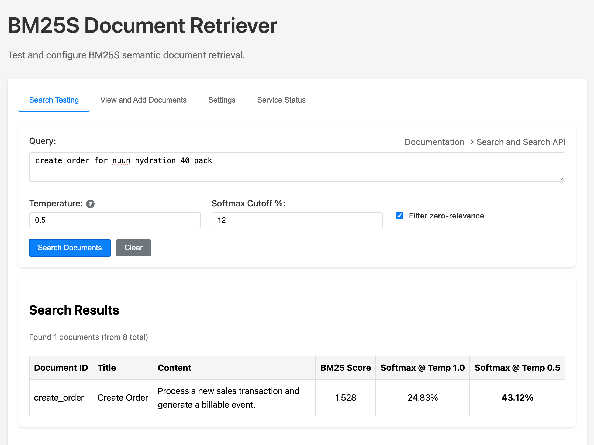

# Axiolex

[](https://pypi.org/project/axiolex/)
[](https://github.com/vrraj/axiolex/releases)


> **Centralized tool discovery and execution gateway for AI clients and enterprise agents.**

Axiolex is a shared service layer that lets AI clients (*Claude Desktop, Cursor, enterprise copilots, custom LLM agents*) dynamically discover and execute tools without registering every endpoint or credential directly in the client.

---

* 📂 **Unified Catalog:** Ranks MCP tools, A2A agent skills, internal REST APIs, and local Python utilities together in a single catalog.
* ⚡ **Normalized Execution:** Decouples clients from transport mechanics — resolving endpoints, protocols, and authentication server-side via `execute(tool_id, arguments)`.
* 🔌 **Flexible Access:** Integrates natively via Python SDK (`pip install axiolex`), REST API, or MCP proxy (`npx @axiolex/mcp-gateway`).
* 🔄 **REST API Adapters:** Connect any REST API via a thin MCP wrapper — includes a built-in Jira adapter (`atlassian_rest_to_mcp`) as an example.
* 🎛️ **Management Dashboard:** Local web UI (`http://localhost:9700/`) for fast provider configuration, visual query testing, and encrypted secret storage.

---

## What Axiolex Solves

Direct tool integration across AI clients creates friction — whether you are a **power user using multiple MCP tools across Claude Desktop and Cursor** or an **enterprise team governing internal agent tools**:

* 📦 **Token Bloat ➔ Intent-Driven Discovery:** Surfaces only the relevant Top-K tools needed for a specific query (`list_namespaces`, `discover`, `execute`) rather than exposing the entire toolset at once.
* 🎯 **Selection Errors ➔ Precise Tool Selection:** Eliminates description overlap and competing tool definitions by scoping active tools strictly to current intent.
* ⚙️ **Configuration Drift ➔ Centralized Control:** Connect endpoints, MCP proxies, and REST APIs once centrally — no manually updating individual client config files across Claude or Cursor.
* 🔒 **Transport Fragmentation ➔ Governed Execution:** Unifies stdio, HTTP, and A2A protocols behind a single gateway with server-side authentication and central audit logging.


# Core Capabilities

Axiolex provides a shared layer for discovering, ranking, and executing enterprise tools across applications and AI clients.

* **Catalog management:** centralized registry for MCP tools, A2A skills, and REST services — automatically synchronized as providers are added or updated.
* **Hybrid tool discovery:** intent-based retrieval (`axiolex_discover_tools`) using BM25S lexical and ColBERT semantic search, with optional domain filtering via namespaces.
* **Normalized execution:** single execution path (`axiolex_execute_tool`) handling stdio, HTTP, A2A, and REST transports server-side with zero client-side credential exposure.
* **Flexible integration surfaces:**
  * **Python SDK** — lightweight programmatic access (`pip install axiolex`).
  * **MCP gateway proxy** — stdio proxy via `npx` ([`@axiolex/mcp-gateway`](https://www.npmjs.com/package/@axiolex/mcp-gateway)) providing instant access for Claude Desktop and Cursor.
  * **REST API** — open endpoints for custom agents and copilot backends.
* **Tool management dashboard:** browser interface (`http://localhost:9700`) for visual query testing, provider management, and AES-256-GCM secret storage.
* **Built-in adapters & interop:** native A2A agent card discovery and lightweight Atlassian Jira REST-to-MCP translation out of the box — no OAuth or `cloudId` required. Compatible with all Atlassian Cloud plans, including Free.


## Axiolex Tool Catalog

Axiolex organizes tools, MCP services, A2A endpoints, and internal services by business domain so discovery can be scoped to the parts of the enterprise relevant to a user query or application request.

| User query | Search scope |
| --- | --- |
| "Show which business units have the largest variance between forecast and actual revenue." | Finance |
| "Check whether the Acme Inc NDA covers product evaluation." | Legal |
| "What health insurance options are available for dependents?" | HR Employee Services |
| "Explain what is driving the predicted supplier lead time up for `SAMSUNG_HBM3e_LINES`." | Supply Chain |
| "Which deals expected to close this quarter are still waiting for contract approval?" | Sales + Legal |

A calling application or AI client can use **single-scope discovery**, **multi-scope discovery**, or **full-catalog discovery**, depending on the request.

Axiolex represents these search scopes as **namespaces**, such as `finance`, `legal`, `sales`, `hr.recruiting`, `hr.employee_services`, and `supply_chain`.

A request can search one namespace, multiple namespaces, or `all`. When a namespace is supplied, it defines a hard search boundary; Axiolex retrieves and ranks capabilities only from that eligible scope.

## How AI Clients and Applications Use Axiolex

Applications and AI clients discover and invoke tools dynamically using query intent and optional namespace scoping. If no namespace is supplied, Axiolex searches the full catalog.

```text
User Request --> Query Intent + Optional Scope --> axiolex_discover_tools() --> Top-K Relevant Tools
```

### Access surfaces

The underlying catalog, retrieval algorithms, and execution services remain identical regardless of how you integrate:

* **MCP tools:** `list_namespaces()`, `axiolex_discover_tools()`, `axiolex_execute_tool()`
* **REST API:** `POST /discover`, `POST /execute`
* **Python SDK:**

```python
results = client.discover(
    query="contract approval status",
    namespaces=["legal"],
    top_k=7,
)
```

### Integration patterns

**Purpose-built enterprise applications:** custom applications controlling their own orchestration can execute discovered tools directly or delegate execution to `axiolex_execute_tool()`.

**AI clients and agents (Claude, Cursor, copilots):** clients obtain namespace descriptions via `list_namespaces()` to maintain context, then discover and execute tools without pre-loading the entire enterprise inventory.

**Full-catalog discovery:** when a workflow requires searching across all business domains, omit the namespace filter:

```python
results = client.discover(
    query="analyze supplier lead-time risk for MICRON_HBM3E in Q4 2026",
)
```

### Best practices for optimal retrieval

**Multi-domain scoping:** pass multiple namespaces (`namespaces=["sales", "legal"]`) to search their union when a single question spans multiple domains.

**Query decomposition:** for compound prompts with multiple distinct tasks, leverage your LLM to split the request into sub-queries before discovery:

```text
"Show open HR roles and summarize Q3 revenue variance"
       ├──> Step 1: discover("open engineering roles", namespaces=["hr"])
       └──> Step 2: discover("Q3 revenue variance", namespaces=["finance"])
```

Focused sub-queries prevent vocabulary from one task from diluting retrieval scores for another.

**Query expansion is a caller responsibility.** The LLM can translate conversational requests into more retrieval-specific intent before calling Axiolex:

```text
"How is Apple doing lately?"
       ↓
"Apple AAPL recent stock price performance and market data"
       ↓
axiolex_discover_tools(...)
```

Axiolex ranks tools against the query it receives; it does not rewrite, expand, or decompose the request itself. Execution sequencing also belongs to the caller, including workflows that require `discover → execute → discover`.

For details on catalog currency, `tools/list_changed` behavior, and discovery quality evaluation, see the [Technical Architecture](docs/architecture.md).


## Unified Tool Execution: One Contract, Any Transport

Axiolex executes any discovered tool via `execute(tool_id, arguments)` regardless of how or where the tool is implemented. The caller never manages downstream endpoints, authentication, or transport mechanics — Axiolex handles resolution server-side and returns a normalized response shape (`{ content: [], is_error: false }`).

### Protocol and provider normalization

Axiolex maps transport mechanics into a single execution interface:

| Aspect | MCP Streamable HTTP | MCP stdio | A2A |
| --- | --- | --- | --- |
| Discovery | `tools/list` over MCP session | `tools/list` over subprocess stdio | GET `/.well-known/agent-card.json` |
| Catalog unit | MCP tool with `inputSchema` | MCP tool with `inputSchema` | A2A skill mapped to tool with `prompt` input |
| Execution | `tools/call` over HTTP/SSE | `tools/call` over stdio pipes | JSON-RPC 2.0 `SendMessage` |
| Required header | `Mcp-Session-Id` | — | `A2A-Version: 1.0` |
| Session | Stateful (initialize handshake) | Stateful (subprocess lifecycle) | Stateless (no handshake) |
| Response | `CallToolResult` with `content[]` | `CallToolResult` with `content[]` | `Task` with `artifacts[].parts[].text` |
| Arguments | Structured key-value matching schema | Structured key-value matching schema | Natural-language `prompt` as text part |
| Execution mode | Synchronous | Synchronous | Synchronous (times out via `UPSTREAM_TIMEOUT`) |

The caller never sees these differences — they call `execute(tool_id, arguments)` and get back the same normalized response regardless of protocol.

> *Direct REST API and local Python function transports are natural extensions of the adapter model and are planned for future releases.*

### Provider configuration examples

Configure remote MCP servers, A2A agents, and local stdio MCP servers in `source_files/mcp_providers.yaml`:

```yaml
# 1. Remote MCP server (Streamable HTTP)
- id: tavily_mcp
  name: Tavily
  transport: streamable-http
  endpoint: https://mcp.tavily.com/mcp
  auth:
    type: api_key
    key_param: tavilyApiKey
    secret_env: TAVILY_API_KEY
  enabled: true
  namespaces: ["research.web"]

# 2. A2A agent skill
- id: veris_finance_a2a
  name: Veris Finance Research (A2A)
  transport: a2a
  endpoint: http://localhost:8100/agents/veris-finance-research-agent/
  auth:
    type: none
  enabled: true
  namespaces: ["veris.research"]

# 3. Local stdio MCP server (e.g. Jira adapter)
- id: jira
  name: Jira
  transport: stdio
  command: python
  args: ["stdio_servers/jira/atlassian_rest_to_mcp.py"]
  auth:
    type: basic
    key_param: api_key
    secret_env: JIRA_API_TOKEN
    username: ${JIRA_USERNAME}
  enabled: true
  namespaces: ["product_management"]
```

### End-to-end example

```python
from axiolex import Axiolex

client = Axiolex("http://localhost:9700")

# Discover — A2A skills are ranked alongside MCP tools
tools = client.discover("financial research on Nvidia", top_k=5)

# Execute — Axiolex resolves transport and credentials server-side
result = client.execute(
    "veris_finance_a2a:financial_research",
    {"prompt": "What was Nvidia revenue in 2024?"}
)

# Result is the same normalized shape regardless of protocol
for item in result["result"]["content"]:
    print(item["text"])
```

A2A execution is synchronous: Axiolex sends the request, waits for the result within the configured timeout, and returns a normalized response. Long-running async task workflows (polling, task IDs, streaming) are a future extension.

For full architecture details, see [docs/architecture.md](docs/architecture.md) and [docs/api-reference.md](docs/api-reference.md).


## Namespace Model

Namespaces organize tools by business area and define which tools are eligible for discovery when a scope is supplied.

| Namespace | Capability area |
| --- | --- |
| `finance` | Financial planning, forecasting, reporting, revenue, costs, and related finance capabilities |
| `legal` | Contracts, agreements, legal review, and related legal capabilities |
| `sales` | Opportunities, accounts, pipeline, and related sales capabilities |
| `hr.recruiting` | Recruiting, open roles, candidates, requisitions, and hiring workflows |
| `hr.employee_services` | Benefits, insurance, leave, compensation, payroll, and employee support |
| `supply_chain` | Suppliers, procurement, inventory, logistics, and related supply-chain capabilities |

**A tool can belong to multiple namespaces**. When scope is supplied, Axiolex searches only those namespaces; unknown namespaces fail explicitly. Namespace names and descriptions are available through list_namespaces().

### Discovery and Orchestration

Axiolex narrows the tool catalog in two steps: **namespace scope defines which tools are eligible, and query intent determines which of those tools rank highest.**

```text
User request
    ↓
query intent + optional namespace scope
    ↓
eligible tool set
    ↓
BM25S + optional ColBERT
    ↓
ranked Top-K tools
    ↓
application / AI client
```

For multiple namespaces, Axiolex searches their union. With `all`, the full catalog is eligible. `top_k` controls the maximum number of tools returned.

The calling application, LLM, or orchestrator decides which returned tools are used, added to model context, or executed.

For multi-domain or multi-step requests, the caller can decompose the request into focused discovery queries and search the appropriate namespace for each step.

For a query that spans multiple domains like "Show me open orders from Acme for HBM3E memory
and check whether Acme is covered under a current NDA", **the caller can decompose it into two focused queries**:

```text
"Show me open orders from Acme for HBM3E memory
and check whether Acme is covered under a current NDA."
                    ↓
            LLM / orchestrator
                    ↓
"Find open Acme orders for HBM3E memory"
    → sales
    → axiolex_discover_tools(...)

"Check current NDA coverage for Acme"
    → legal
    → axiolex_discover_tools(...)
```

**Conversational requests can also be expanded into more retrieval-specific intent** before discovery. **Axiolex itself does not rewrite, decompose, or orchestrate the request**; it ranks tools against the query and optional namespace scope it receives.

**Execution sequencing also remains with the caller**, including workflows that require `discover → execute → discover`.


## Integration Surfaces & Client Access

Applications and AI clients access Axiolex through three front-door surfaces. All three hit the same backend engine — same Redis catalog, retrieval logic, and execution dispatcher.

```text
External Python app  ──►  Python SDK  ──┐
                                        │
Any HTTP client      ──►  REST API   ──┼──►  FastAPI server (:9700)  ──►  Catalog & Execution
                                        │         └── /mcp (Streamable HTTP / stdio proxy)
AI client / LLM      ──►  MCP Server  ──┘
```

### Operations & code quickstart

| Capability | Python SDK (`pip install axiolex`) | REST API (language-agnostic) | MCP interface (Claude, Cursor, agents) |
| --- | --- | --- | --- |
| List scopes | `client.list_namespaces()` | `GET /namespaces` | `list_namespaces()` |
| Discover tools | `client.discover(query, top_k=5)` | `POST /discover` | `axiolex_discover_tools(query, ...)` |
| Execute tool | `client.execute(tool_id, args)` | `POST /execute` | `axiolex_execute_tool(tool_id, ...)` |

### 1. Python SDK

Ideal for Python applications, custom orchestration pipelines, or batch workflows requiring programmatic control without MCP dependencies.

```python
from axiolex import Axiolex

client = Axiolex("http://localhost:9700")

# Programmatic discovery and execution
tools = client.discover("get stock earnings", top_k=5, namespaces=["finance"])
result = client.execute(tools["tools"][0]["tool_id"], {"symbol": "AAPL"})
```

The base PyPI package is a thin HTTP client (httpx + pydantic only) — no Redis, ColBERT, or ML dependencies on the client side.

### 2. REST API

Language-agnostic HTTP interface for non-Python applications (Go, Java, JS), enterprise microservices, or direct service-mesh integration.

```bash
curl -X POST http://localhost:9700/discover \
  -H "Content-Type: application/json" \
  -d '{"query": "contract approval status", "namespaces": ["legal"]}'
```

### 3. MCP server (AI client access)

Connects Claude Desktop, Cursor, Codex, and custom agents directly to Axiolex without client-side Python installations or local tool management. The MCP endpoint URL and npx proxy command are the same across all clients — only the config file location and format differs.

**Streamable HTTP** (preferred — no proxy needed):

Claude Desktop and Cursor (`~/Library/Application Support/Claude/claude_desktop_config.json` or `~/.cursor/mcp.json`):

```json
{
  "mcpServers": {
    "axiolex": { "url": "http://localhost:9700/mcp" }
  }
}
```

Codex (`~/.codex/config.toml` — TOML format):

```toml
[mcp_servers.axiolex]
url = "http://localhost:9700/mcp"
enabled = true
```

Or via Codex CLI: `codex mcp add axiolex --url http://localhost:9700/mcp`

**Stdio via [`@axiolex/mcp-gateway`](https://www.npmjs.com/package/@axiolex/mcp-gateway) (Node.js proxy):**

For clients that require stdio transport. Use the absolute path to `npx` (`which npx`) to avoid PATH resolution issues — Claude Desktop uses a restricted system PATH that may not include nvm/volta paths.

Claude Desktop and Cursor (JSON):

```json
{
  "mcpServers": {
    "axiolex": {
      "command": "/absolute/path/to/npx",
      "args": ["-y", "@axiolex/mcp-gateway", "--endpoint", "http://localhost:9700/mcp"]
    }
  }
}
```

Codex (TOML):

```toml
[mcp_servers.axiolex]
command = "npx"
args = ["-y", "@axiolex/mcp-gateway", "--endpoint", "http://localhost:9700/mcp"]
enabled = true
```

No install needed — `npx -y @axiolex/mcp-gateway` fetches and caches the package automatically. The proxy is a ~120-line Node.js package with one dependency (`@modelcontextprotocol/sdk`) — no Python, no Redis, no ML libraries. Source is in [`mcp-gateway/`](mcp-gateway/) in this repo.

For client-specific MCP docs:
- [Claude Desktop](https://modelcontextprotocol.io/quickstart/user)
- [Cursor](https://cursor.com/docs/mcp)
- [Codex](https://learn.chatgpt.com/docs/extend/mcp)

See [Connect Claude Desktop](docs/claude-mcp.md) for a full walkthrough including enterprise deployment.

> **Note on MCP prefixing:** the `axiolex_` prefix on MCP tool names (`axiolex_discover_tools`, `axiolex_execute_tool`) prevents naming collisions when an LLM connects to multiple MCP servers simultaneously.

### Administrative & operator boundaries

Provider registration, index refreshes, namespace management, and credential secrets are strictly operator functions — isolated from client-facing access surfaces and managed exclusively via:

* **Admin REST surface:** `/mcp-providers`, `/namespaces`, `/mcp-providers/{id}/secret`
* **Axiolex Web UI** and **`axiolex-index` CLI** tooling

## Retrieval Engine & Schema Contracts

Axiolex ranks tools within selected namespaces using a hybrid retrieval engine combining lexical and semantic search. Consuming clients receive normalized discovery and execution contracts regardless of backend transport.

```text
Query Intent --> Namespace Scope --> BM25S Lexical + ColBERT Semantic --> Ranked Top-K Tools
```

> Retrieval mode and ranking weights are deployment settings. For tuning details (temperature, hybrid weights, ColBERT model configuration), see the [Application Reference](docs/app_reference.md). For full architecture details, see the [Technical Architecture](docs/architecture.md).

### Discovery result contract

Calling `axiolex_discover_tools()` or `POST /discover` returns execution-ready tool specs containing runtime schemas and relevance scores (0.0 to 1.0):

```json
{
  "tool_id": "finance.market_data.get_quote",
  "name": "get_quote",
  "description": "Retrieve the latest market quote for a security",
  "namespace": "finance",
  "provider": "market-data-mcp",
  "relevance_score": 0.94,
  "bm25_score": 12.4,
  "colbert_score": 0.88,
  "parameters": {
    "type": "object",
    "properties": {
      "symbol": { "type": "string" }
    },
    "required": ["symbol"]
  }
}
```

### Execution request & response specs

Tool execution via `axiolex_execute_tool()` or `POST /execute` resolves endpoints and validates schemas server-side. Callers supply only the stable `tool_id` and matching arguments.

| Field | Type | Required | Description |
| --- | --- | --- | --- |
| `tool_id` | string | Yes | Stable Axiolex identifier returned during discovery |
| `arguments` | object | Yes | Parameters validated against the tool's current schema |
| `idempotency_key` | string | No | Optional client key logged for request de-duplication |
| `timeout_ms` | integer | No | Execution timeout override (clamped to server ceiling, default 30s) |

```json
{
  "status": "success",
  "tool_id": "finance.market_data.get_quote",
  "execution_id": "exec_98f2a11b0c",
  "result": {
    "content": [{ "type": "text", "text": "AAPL: $224.23 (+1.2%)" }]
  },
  "error": null
}
```

### Standardized execution error codes

When `status = "error"`, Axiolex returns normalized error codes across all transports:

| Error code | Description | Retryable |
| --- | --- | --- |
| `TOOL_NOT_FOUND` | `tool_id` does not resolve in current catalog | No |
| `TOOL_UNAVAILABLE` | Tool transport is disabled or unsupported | No |
| `INVALID_ARGUMENTS` | Parameters failed schema validation against current spec | No |
| `UPSTREAM_TIMEOUT` | Downstream provider exceeded execution `timeout_ms` | Yes |
| `UPSTREAM_ERROR` | Downstream tool/transport returned a runtime error | Depends |
| `RATE_LIMITED` | Axiolex dispatcher or upstream provider rate limit hit | Yes |
| `INTERNAL_ERROR` | Server-side dispatcher or transport failure | Yes |

### Python asynchronous execution quickstart

```python
import asyncio
from axiolex import execute_tool

async def main():
    response = await execute_tool(
        tool_id="text_tools:extract_keywords",
        arguments={"text": "Axiolex routes requests using hybrid retrieval", "max_keywords": 5},
    )
    if response["status"] == "success":
        print(response["result"]["content"][0]["text"])

asyncio.run(main())
```

### Observability & artifact routing

**Artifact-aware metadata:** tools producing visual assets (e.g. SVG charts, HTML UI blocks) include artifact metadata. Host gateways use this to send raw rendered outputs directly to client UIs while returning compact semantic summaries to the LLM context.

```text
Axiolex discovers tool --> Host gateway executes --+--> Raw rendered output --> Client UI
                                                 +--> Compact semantic result --> LLM context
```

**Discovery audit logging:** Axiolex logs discovery queries and execution attempts for security evaluation, routing diagnostics, and relevance evaluation — without blocking client requests.

* **Captured:** query string, namespace boundaries, Top-K candidates with relevance scores, execution latency, caller identifiers
* **Storage:** asynchronous, append-only JSONL logging with zero latency impact on responses

```json
{
  "timestamp": "2026-09-04T14:30:00Z",
  "caller_id": "copilot_agent_v2",
  "query": "contract approval status",
  "namespaces": ["legal"],
  "results": [
    { "tool_id": "legal:get_contract_status", "relevance_score": 0.87 }
  ],
  "latency_ms": 24
}
```

**Log location:** `logs/discovery_audit.jsonl` (override with `AXIOLEX_LOG_DIR`). Rotates at 10 MB with 5 backups.

## Setup & Quick Start

### 1. Server installation & local run

Axiolex runs as a shared FastAPI service backed by Redis for catalog state. Choose either host-based installation or containerized deployment.

**Option A: Local host setup (recommended for dev):**

```bash
# Clone repository
git clone https://github.com/vrraj/axiolex.git && cd axiolex

# Install server & dependencies (BM25 lexical search enabled)
make install

# Optional: add ColBERT hybrid search (semantic retrieval)
make colbert

# Start local services (Redis + Axiolex API)
make start
```

**Option B: Docker deployment (production-like):**

```bash
# Spin up Axiolex and Redis in isolated containers
make docker-up

# Verify service health
curl http://localhost:9700/status
```

ColBERT model cache is bind-mounted to the host via `AXIOLEX_COLBERT_CACHE_HOST_DIR` (default: `~/models/fastembed_cache`) so model downloads persist across container rebuilds and are shared with host-mode runs.

Once running, access the web dashboard at http://localhost:9700/.

**Install extras:**

| Extra | Command | Purpose |
| --- | --- | --- |
| `server` | `pip install "axiolex[server]"` | FastAPI, Uvicorn, BM25S, PyStemmer, Redis, MCP SDK, cryptography |
| `colbert` | `pip install "axiolex[colbert]"` | FastEmbed, ONNX Runtime, NumPy, ColBERT hybrid retrieval |
| `dev` | `pip install "axiolex[dev]"` | pytest, black, ruff |

> **ColBERT is optional at install time.** `make install` gives you a fully working server with BM25 lexical search. Run `make colbert` to add semantic retrieval, then set `AXIOLEX_HYBRID_ENABLED=true` in `.env`. If you skip `make colbert`, `make start` will install the packages on first launch (one-time download delay).

### 2. Connect AI clients (MCP setup)

Axiolex exposes MCP at `http://localhost:9700/mcp`. See [Integration Surfaces & Client Access](#integration-surfaces--client-access) for configuration examples for Claude Desktop, Cursor, and Codex (streamable HTTP and npx stdio proxy).

### 3. Application & SDK access

For Python SDK and REST API code examples, see [Integration Surfaces & Client Access](#integration-surfaces--client-access).

### Axiolex MCP Tools

Axiolex exposes three MCP tools to AI clients. These are the only tools Claude, Cursor, or Codex see — downstream provider tools (Jira, Alpha Vantage, Tavily, etc.) are discovered and executed through Axiolex, not exposed directly.

| Tool | Purpose |
| --- | --- |
| `list_namespaces` | List all enabled tool domains (e.g. `finance.market_data`, `research.web`) |
| `axiolex_discover_tools` | Find tools relevant to a natural-language request, optionally filtered by namespace |
| `axiolex_execute_tool` | Execute a discovered tool by its `tool_id` with validated arguments |

**How AI clients use them:**

1. Call `list_namespaces` early in the session to learn what tool domains Axiolex covers. Keep the result in memory.
2. When a user request comes in, call `axiolex_discover_tools` with the query. Optionally pass one or more namespace IDs to filter results to a relevant domain.
3. Call `axiolex_execute_tool` with the `tool_id` returned by discovery and the arguments matching the tool's input schema.

**Where tool descriptions are defined:**

Each tool's description is split into two parts in `axiolex/mcp/server.py`:

- **Contract** (`_*_CONTRACT` variables) — describes what the tool does. Part of the MCP contract; **do not change**.
- **Behavior** (`_*_BEHAVIOR` variables) — tells the AI client how to present results to the user (e.g. "list the tool names you found at the end of your response"). Freely editable.

The final description sent to the client is: `description = CONTRACT + " " + BEHAVIOR`

To change the behavioral wording, edit the `_BEHAVIOR` variables in `axiolex/mcp/server.py`, then restart the server:

```bash
make stop && make start
```

### @axiolex/mcp-gateway (npm package)

The stdio proxy is published as [`@axiolex/mcp-gateway`](https://www.npmjs.com/package/@axiolex/mcp-gateway) on npm. The proxy version is independent of the Axiolex Python package version. Bump `mcp-gateway/package.json` and publish to npm when the proxy changes.

**For developers working on the proxy itself:**

```bash
cd mcp-gateway
npm install          # install dependencies
node index.js --endpoint http://localhost:9700/mcp   # run locally
npm publish --access public   # publish new version (requires npm login)
```

### Common Makefile targets

| Target | Purpose |
| --- | --- |
| `make install` | Install Axiolex server and development dependencies with BM25 lexical retrieval |
| `make colbert` | Add optional ColBERT hybrid retrieval dependencies |
| `make start` | Start Redis, refresh the catalog, and run the Axiolex services |
| `make stop` | Stop local services |
| `make docker-up` | Run full stack (Axiolex + Redis) in Docker containers |
| `make docker-down` | Stop and remove Docker containers |
| `make index-refresh` | Rebuild the Redis catalog from configured sources |
| `make test` | Run the test suite |
| `make format` | Format code and run lint fixes |
| `make type-check` | Run static type checks |
| `make build` | Build Python package artifacts |
| `make clean` | Remove local build and Python cache artifacts |

**Links:** [PyPI](https://pypi.org/project/axiolex/) · [GitHub](https://github.com/vrraj/axiolex) · [API Documentation](https://vrraj.github.io/axiolex/)

## Web UI & Operational Control

The Axiolex Web UI is the primary management, administration, and testing control plane for enterprise tool governance. Accessible at http://localhost:9700/, it provides live visual control over the capability catalog, retrieval engines, and provider security without requiring custom code or client restarts.

```text
┌────────────────────────────────────────────────────────────────────────────────────────┐
│                              AXIOLEX DASHBOARD & CONTROL PLANE                         │
├───────────────────────────────┬───────────────────────────────┬────────────────────────┤
│  1. Provider Management       │  2. Interactive Testing       │  3. Retrieval Tuning   │
│  • Dynamic Add/Edit/Disable   │  • Live Query Discovery       │  • BM25 Lexical        │
│  • Encrypted Secrets (GCM)    │  • Relevance Score Validation │  • ColBERT Semantic    │
│  • Direct Tool Execution      │  • Namespace Scope Inspection │  • Adjust top_k Bounds │
└───────────────────────────────┴───────────────────────────────┴────────────────────────┘
│                     *Operates against the unified Axiolex REST API*                    │
└────────────────────────────────────────────────────────────────────────────────────────┘
```

### Core operations & management capabilities

* **Provider registration & lifecycle:** register, enable, disable, or refresh downstream MCP providers (stdio and Streamable HTTP), A2A agents, and local tool definitions. Configure transport, endpoints, auth, and namespace assignments from a single form. Reindex the catalog (rebuild BM25S + ColBERT indexes) or reload from cache after provider changes.
* **Encrypted secret management:** configure provider authentication (Basic auth, Bearer tokens, API keys) securely via the UI — encrypting secrets directly into the AES-256-GCM backend (`mcp_secrets.enc`).
* **Discovery evaluation & interactive testing:** run live discovery queries with different parameters (namespace scope, `top_k`, hybrid search toggle) to evaluate retrieval quality, relevance scores, and ranking behavior before rolling out to AI agents. Execute discovered tools directly to verify arguments, schema compliance, and provider responses.
* **Retrieval engine tuning:** bench-test hybrid search performance live by toggling between BM25S lexical search and ColBERT semantic retrieval, adjusting temperature, softmax cutoff, and `top_k` response limits. Inspect rank and relevance scores across namespaces.
* **Namespace setup & inspection:** create, edit, and delete namespaces; explore the unified catalog hierarchy to audit domain boundaries, tool assignments, and schema definitions across the enterprise.
* **System status:** monitor service health, Redis connectivity, retriever status, and catalog version.

The Web UI operates against the same Axiolex REST API and catalog as the Python SDK, MCP interface, and CLI tools.



## Security Overview

Axiolex enforces a dual-boundary security architecture: securing clients accessing Axiolex and protecting Axiolex accessing downstream providers.

```text
┌─────────────────┐    Authenticated Boundary    ┌─────────────────┐   Server-Side Secrets   ┌──────────────────┐
│  Client / LLM   │ ───────────────────────────► │ Axiolex Gateway │ ──────────────────────► │ Downstream Provider│
│ (Claude/Cursor) │  OAuth2 / mTLS / API Keys    │  (AES-256-GCM)  │   Service Accounts     │  (Jira / Tavily) │
└─────────────────┘                              └─────────────────┘                         └──────────────────┘
```

### 1. Client authentication & authorization

* **Trusted environment model:** requests to REST, MCP, SDK, and Web UI endpoints should be authenticated at the enterprise boundary (e.g. via OAuth/OIDC, mTLS, or API keys).
* **Isolation:** consuming applications and AI clients never receive or negotiate downstream provider credentials.

### 2. Downstream provider authentication

* **Encrypted secret store:** secrets are stored in `source_files/mcp_secrets.enc`, encrypted at rest using AES-256-GCM. Master keys are passed via `AXIOLEX_SECRET_MASTER_KEY`.
* **Resolution hierarchy:** Axiolex resolves credentials via environment variables (`auth.secret_env`) first, falling back to the encrypted secret store second.
* **Redaction & zero-leakage:** provider tokens are injected into child processes at runtime (e.g. via stdio environment variables). Credentials are strictly stripped from logs, REST payloads, and Redis metadata.

### 3. Identity model & lifecycle

| Dimension | Current phase (service accounts) | Future phase (per-user delegation) |
| --- | --- | --- |
| Credential storage | Centralized in Axiolex encrypted store (1 service account / provider) | Axiolex per-user credential mapping or OAuth token exchange |
| Client configuration | Axiolex server URL only | Axiolex server URL only |
| User authentication | Enterprise boundary (OAuth / API keys) | Enterprise boundary (OAuth / API keys) |
| Audit trail | Downstream logs show central service account | Downstream logs reflect individual user identity |

For provider YAML configurations, detailed secret store setup, and adapter specifications, see [docs/architecture.md](docs/architecture.md).

## API Reference

Comprehensive OpenAPI / Swagger interactive documentation is served directly from a running instance at http://localhost:9700/docs.

### Core API & SDK mapping

| Operation | REST endpoint | Python SDK method | Description |
| --- | --- | --- | --- |
| Discovery | `POST /discover` | `client.discover()` | Search ranked capabilities using BM25S / ColBERT |
| Execution | `POST /execute` | `client.execute()` | Execute a discovered tool using its `tool_id` |
| Namespaces | `GET /namespaces` | `client.list_namespaces()` | List registered enterprise tool domains and scopes |
| System status | `GET /status` | `client.health()` | Health check, uptime, and underlying Redis metrics |

### Management & administration endpoints

| Method | Path | Purpose |
| --- | --- | --- |
| `GET/POST/PUT/DELETE` | `/mcp-providers` | Manage registered MCP/A2A provider definitions |
| `POST/GET/DELETE` | `/mcp-providers/{id}/secret` | Store, check existence of, or clear encrypted provider credentials |
| `POST/PUT/DELETE` | `/namespaces/{id}` | Manage capability domain filtering and scoping |

For complete request/response JSON schemas and CLI commands, see the [Application Reference](docs/app_reference.md).

## Development

For local development setup, see [Setup & Quick Start](#setup--quick-start).

For details on MCP tool descriptions and how to customize AI client behavior, see [Axiolex MCP Tools](#axiolex-mcp-tools).

Additional Docker targets:

```bash
make docker-logs          # tail Axiolex container logs
make docker-restart       # restart Axiolex (e.g. after editing source_files/*.yaml)
make docker-build         # rebuild image without cache
make docker-down-volumes  # stop + wipe volumes (full reset)
```

For full Docker configuration details, Redis placement options, and environment variables, see the [Technical Architecture](docs/technical_architecture.md).

## Documentation and License

### Documentation

- [GitHub Repository](https://github.com/vrraj/axiolex)
- [PyPI Package](https://pypi.org/project/axiolex/)
- [API Documentation](https://vrraj.github.io/axiolex/)
- [Technical Architecture](docs/technical_architecture.md) — system layers, request lifecycle, subsystems, module reference, deployment
- [Application Reference](docs/app_reference.md) — install, SDK API, REST endpoints, CLI, configuration, MCP integration
- [Claude Desktop Setup](docs/claude-mcp.md) — connecting Claude to the Axiolex MCP server
- [Medium: Context Engineering for Tool-Heavy Agents](https://medium.com/@vr.rajkumar99/context-engineering-for-tool-heavy-agents-lexical-routing-c1b0ebad7495)

### Third-Party Model Notice

Optional hybrid retrieval downloads the pinned [`colbert-ir/colbertv2.0`](https://huggingface.co/colbert-ir/colbertv2.0) checkpoint through FastEmbed.

The model is not included in the repository or Axiolex package. Its model card declares the [MIT License](https://opensource.org/license/mit); see the [upstream model card](https://huggingface.co/colbert-ir/colbertv2.0) for the model and its current metadata.

### License

Axiolex is available under the [GNU GPLv3](LICENSE).

Feel free to clone, explore, modify, and build with Axiolex under the
terms of GPLv3.

Commercial licensing is also available for organizations interested in
incorporating Axiolex into proprietary products or custom solutions.

ai-musings99@gmail.com
